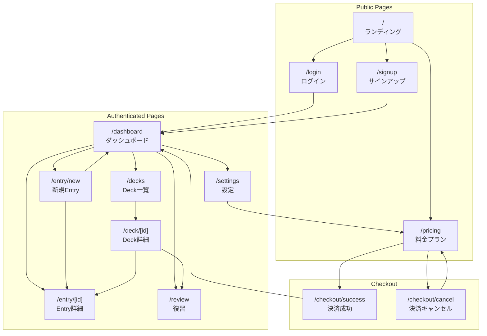

# 02. User Flows - Web

## 全体画面遷移図



---

## 画面別詳細フロー

### 1. ランディングページ (`/`)

```mermaid
flowchart LR
    A[アクセス] --> B{ログイン状態?}
    B -->|Yes| C[/dashboard へリダイレクト]
    B -->|No| D[LP表示]
    D --> E[CTAボタン]
    E --> F[/signup へ遷移]
```

**画面要件:**
- ヒーローセクション（キャッチコピー + CTA）
- 機能紹介（3-4項目）
- 料金プラン概要
- ヘッダー: ログイン/サインアップボタン

**コンポーネント:**
```
<Header />
  - Logo
  - Nav: [機能, 料金]
  - AuthButtons: [ログイン, 新規登録]
<Hero />
  - Headline: "知らない言葉に出会ったら、登録するだけ"
  - Subline: "AIとSRSで効率的に記憶定着"
  - CTA: "無料で始める"
<Features />
  - Feature 1: AI自動生成
  - Feature 2: SRS復習
  - Feature 3: マルチプラットフォーム
<PricingPreview />
  - Free vs Plus 比較表
  - CTAボタン
<Footer />
```

---

### 2. サインアップ (`/signup`)

```mermaid
flowchart TB
    A[/signup 表示] --> B[フォーム入力]
    B --> C{入力バリデーション}
    C -->|Error| D[エラー表示]
    D --> B
    C -->|OK| E[Supabase Auth 呼び出し]
    E --> F{認証結果}
    F -->|成功| G[/dashboard へ遷移]
    F -->|失敗| H[エラー表示]
    H --> B

    A --> I[Google OAuth]
    I --> E
```

**画面要件:**
- Email/Password入力フォーム
- Google OAuthボタン
- ログインページへのリンク
- 利用規約・プライバシーポリシーへのリンク

**フォームフィールド:**
| フィールド | タイプ | バリデーション |
|-----------|--------|----------------|
| Email | email | 必須, 形式チェック |
| Password | password | 必須, 8文字以上 |
| Password確認 | password | 必須, 一致チェック |

---

### 3. ダッシュボード (`/dashboard`)

```mermaid
flowchart TB
    A[/dashboard 表示] --> B[データ取得]
    B --> C[統計サマリー表示]
    B --> D[Entry一覧表示]
    B --> E[Due Entry数表示]

    C --> F[詳細統計へ]
    D --> G[Entry詳細へ]
    E --> H[復習開始へ]

    A --> I[新規Entryボタン]
    I --> J[/entry/new へ]
```

**画面要件:**
- 統計サマリー（総Entry数、Due数、今日の復習数）
- Entry一覧（最新20件、ページネーション）
- クイックアクション（新規Entry、復習開始）
- Deck別フィルター

**コンポーネント:**
```
<DashboardHeader />
  - ユーザー名
  - 新規Entryボタン
  - 設定アイコン
<StatsCards />
  - 総Entry数
  - Due Entry数（復習待ち）
  - 今日の復習完了数
  - 連続学習日数
<QuickActions />
  - "復習を始める" ボタン（Due > 0 の場合）
  - "新しいEntryを追加" ボタン
<EntryList />
  - EntryCard × n
  - ページネーション
<DeckFilter />
  - 全て / Deck1 / Deck2 / ...
```

---

### 4. 新規Entry作成 (`/entry/new`)

```mermaid
flowchart TB
    A[/entry/new 表示] --> B[Term入力]
    B --> C{Context入力?}
    C -->|あり| D[Context入力]
    C -->|なし| E[スキップ]
    D --> F[Deck選択]
    E --> F
    F --> G["AI生成" ボタン押下]
    G --> H{使用量チェック}
    H -->|上限内| I[API呼び出し]
    H -->|上限超過| J[アップグレード促進]
    J --> K[/pricing へ]
    I --> L[Enrichment表示]
    L --> M{内容確認}
    M -->|OK| N["保存" ボタン]
    M -->|再生成| G
    N --> O[Entry保存]
    O --> P[/entry/[id] へ遷移]
```

**画面要件:**
- Term入力（必須、最大200文字）
- Context入力（任意、最大500文字）
- Deck選択（デフォルト: "Default"）
- AI生成ボタン
- 生成結果プレビュー
- 保存/キャンセルボタン

**Enrichment表示項目:**
```
<EnrichmentPreview>
  - 日本語訳
  - 英語訳
  - 3行要約
  - 使用例（2-3例）
  - 関連語（3-5語）
  - 参考リンク候補（2-3件）
</EnrichmentPreview>
```

**フォーム状態:**
```typescript
interface EntryForm {
  term: string;           // 必須
  context?: string;       // 任意
  deckId?: string;        // 任意（デフォルトDeck）
  enrichment?: Enrichment; // AI生成後に設定
}

interface Enrichment {
  translation_ja: string;
  translation_en: string;
  summary: string;
  examples: string[];
  related_terms: string[];
  reference_links: { title: string; url: string }[];
}
```

---

### 5. Entry詳細 (`/entry/[id]`)

**画面要件:**
- Entry全情報表示
- 編集モード切替
- 削除確認ダイアログ
- Deck移動
- SRS情報表示（次回復習日、Ease Factor）

**コンポーネント:**
```
<EntryHeader>
  - Term（大きく表示）
  - Deck名
  - 編集/削除ボタン
</EntryHeader>
<EntryContent>
  - Context（あれば）
  - 日本語訳
  - 英語訳
  - 要約
  - 使用例
  - 関連語
  - 参考リンク
</EntryContent>
<SRSInfo>
  - 次回復習日
  - Ease Factor
  - 復習回数
  - 作成日
</SRSInfo>
<Actions>
  - "復習キューに追加" / "復習キューから除外"
  - "Enrichment再生成"
</Actions>
```

---

### 6. 復習セッション (`/review`)

```mermaid
flowchart TB
    A[/review 表示] --> B{Due Entry存在?}
    B -->|No| C[完了メッセージ表示]
    B -->|Yes| D[カード表示（表面）]
    D --> E["めくる" ボタン]
    E --> F[カード表示（裏面）]
    F --> G[難易度選択]
    G --> H{選択}
    H -->|Again| I[SRS更新: 間隔リセット]
    H -->|Hard| J[SRS更新: 間隔短縮]
    H -->|Good| K[SRS更新: 標準]
    H -->|Easy| L[SRS更新: 間隔延長]
    I --> M{次のカード?}
    J --> M
    K --> M
    L --> M
    M -->|Yes| D
    M -->|No| N[セッション完了]
    N --> O[結果サマリー表示]
    O --> P[/dashboard へ]
```

**画面要件:**
- フラッシュカードUI（表/裏）
- 難易度ボタン（Again/Hard/Good/Easy）
- 進捗表示（n/m）
- セッション終了ボタン
- 結果サマリー

**カード表示:**
```
<ReviewCard>
  <!-- 表面（問題） -->
  <CardFront>
    - Term（大きく）
    - Context（あれば、ヒントとして）
  </CardFront>

  <!-- 裏面（回答） -->
  <CardBack>
    - 日本語訳
    - 英語訳
    - 要約
    - 使用例（1つ）
  </CardBack>
</ReviewCard>

<DifficultyButtons>
  - Again（赤）: < 1分後に再表示
  - Hard（オレンジ）: 現在間隔の1.2倍
  - Good（緑）: 現在間隔 × Ease Factor
  - Easy（青）: 現在間隔 × Ease Factor × 1.3
</DifficultyButtons>

<Progress>
  - "5 / 20" 形式
  - プログレスバー
</Progress>
```

---

### 7. Deck管理 (`/decks`, `/deck/[id]`)

**`/decks` 画面要件:**
- Deck一覧（カード形式）
- 各Deckの統計（Entry数、Due数）
- 新規Deck作成ボタン
- Deck編集/削除

**`/deck/[id]` 画面要件:**
- Deck内Entry一覧
- Deck名編集
- "このDeckで復習" ボタン
- Entry移動機能

---

### 8. 設定 (`/settings`)

**画面要件:**
- プロフィール（名前、メール）
- プラン情報
- 使用量表示（今月の生成数）
- アカウント削除
- ログアウト

**セクション:**
```
<ProfileSection>
  - 表示名変更
  - メールアドレス（変更不可、表示のみ）
</ProfileSection>

<PlanSection>
  - 現在のプラン
  - 使用量（n / m 回）
  - プログレスバー
  - "アップグレード" or "プラン変更" ボタン
  - クレジット残高（Plus以上）
</PlanSection>

<DangerZone>
  - ログアウト
  - アカウント削除
</DangerZone>
```

---

### 9. 料金プラン (`/pricing`)

**画面要件:**
- プラン比較表（Free / Plus）
- クレジットパック一覧
- FAQ
- Stripeチェックアウトへの遷移

**プラン比較表:**
| 機能 | Free | Plus |
|------|------|------|
| Entry登録 | 無制限 | 無制限 |
| AI生成 | 20回/月 | 200回/月 |
| SRS復習 | 無制限 | 無制限 |
| Deck数 | 5 | 無制限 |
| クレジット購入 | 不可 | 可能 |
| 価格 | $0 | $4.99/月 |

---

## レスポンシブ対応

### ブレークポイント
| 名前 | 幅 | 対応 |
|------|-----|------|
| Mobile | < 640px | スマホ |
| Tablet | 640-1024px | タブレット |
| Desktop | > 1024px | PC |

### 主要な変更点
- Mobile: ハンバーガーメニュー、カード1列
- Tablet: サイドバー折りたたみ、カード2列
- Desktop: サイドバー表示、カード3列

---

## エラー状態

### 共通エラーUI
```
<ErrorBoundary>
  - エラーメッセージ
  - リトライボタン
  - ホームへ戻るリンク
</ErrorBoundary>
```

### 特定エラー
| 状態 | 表示 |
|------|------|
| 認証エラー | /login へリダイレクト |
| 404 | 専用404ページ |
| 500 | エラーページ + 報告リンク |
| AI生成失敗 | リトライ促進 |
| 決済エラー | エラー詳細 + サポートリンク |

---

## ローディング状態

### スケルトン表示
- Dashboard: StatsCards + EntryListのスケルトン
- Entry詳細: コンテンツエリアのスケルトン
- AI生成中: スピナー + "生成中..." メッセージ

### 楽観的更新
- 復習難易度選択: 即座に次カードへ（バックグラウンドでSRS更新）

---

## 関連ドキュメント

- [01_prd.md](./01_prd.md) - PRD
- [03_architecture_web.md](./03_architecture_web.md) - アーキテクチャ
- [05_api_design.md](./05_api_design.md) - API設計
