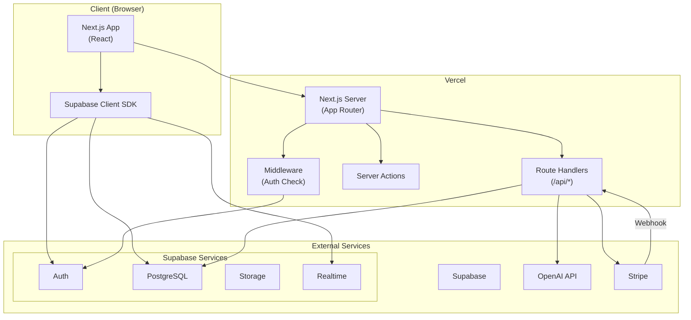
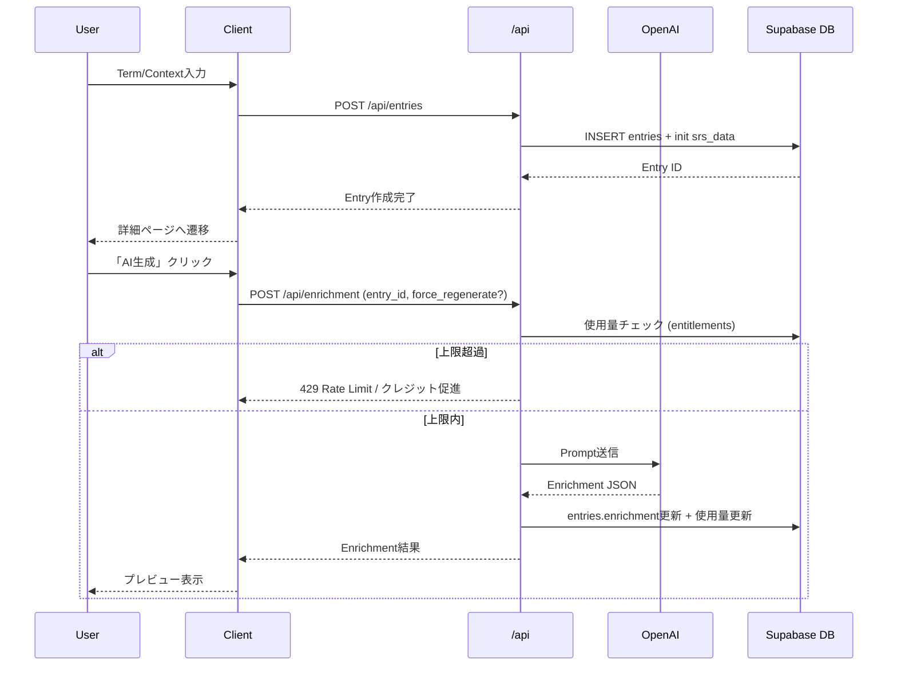
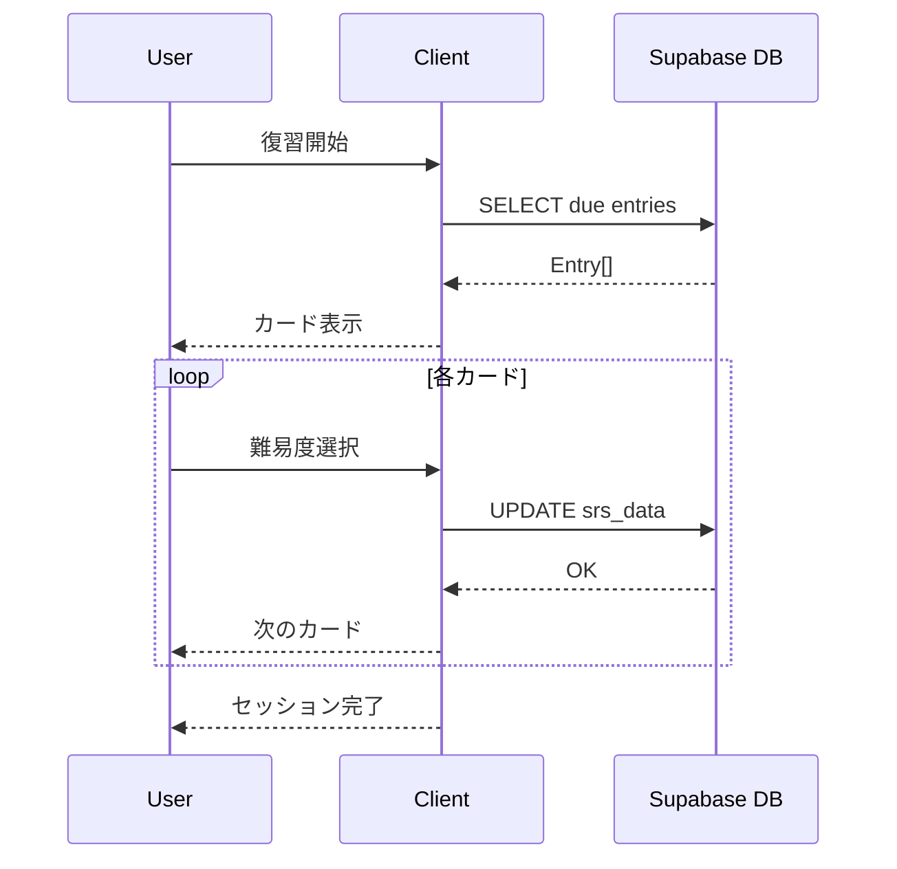
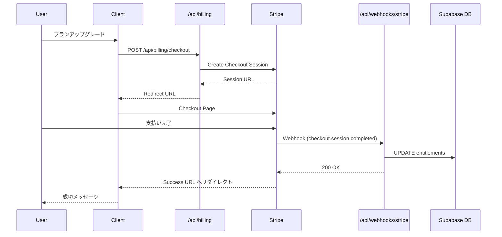

# 03. Architecture - Web

## システム構成図



---

## レイヤー構成

```
┌─────────────────────────────────────────────┐
│  Presentation Layer (React Components)       │
├─────────────────────────────────────────────┤
│  Application Layer (Hooks, Context)          │
├─────────────────────────────────────────────┤
│  API Layer (Route Handlers, Server Actions)  │
├─────────────────────────────────────────────┤
│  Service Layer (Business Logic)              │
├─────────────────────────────────────────────┤
│  Data Access Layer (Supabase Client)         │
├─────────────────────────────────────────────┤
│  Infrastructure (Supabase, OpenAI, Stripe)   │
└─────────────────────────────────────────────┘
```

---

## コンポーネント詳細

### 1. Next.js App (Client)

```typescript
// ディレクトリ構成
app/
├── (public)/              // 未認証ページ
│   ├── page.tsx          // ランディング
│   ├── login/
│   ├── signup/
│   └── pricing/
├── (authenticated)/       // 認証必須ページ
│   ├── dashboard/
│   ├── entry/
│   ├── review/
│   ├── decks/
│   └── settings/
├── api/                   // Route Handlers
│   ├── entries/
│   ├── enrichment/
│   ├── review/
│   ├── billing/
│   └── webhooks/
├── layout.tsx
└── middleware.ts
```

### 2. Route Handlers (`/api`)

| エンドポイント | 役割 |
|---------------|------|
| `/api/entries` | Entry CRUD |
| `/api/enrichment` | AI生成（LLM呼び出し、entry_idを指定） |
| `/api/entries/import` | CSVインポート（multipart form） |
| `/api/entries/export` | CSVエクスポート |
| `/api/review/due` | Due Entry取得 |
| `/api/review/[id]` | SRS更新 |
| `/api/profile` | プロフィール取得/更新 |
| `/api/billing/checkout` | Stripe Checkout Session作成 |
| `/api/billing/portal` | Stripe Customer Portal |
| `/api/billing/credits/purchase` | クレジット購入Checkout |
| `/api/webhooks/stripe` | Stripe Webhook受信 |

### 3. Supabase Integration

```typescript
// クライアントサイド
import { createBrowserClient } from '@supabase/ssr'

// サーバーサイド (Route Handler)
import { createServerClient } from '@supabase/ssr'

// サーバーサイド (Server Component)
import { createServerClient } from '@supabase/ssr'
```

### 4. LLMプロンプト管理

- `apps/web/lib/llm/prompts.ts` にシステム/ユーザープロンプトを定義し `getPromptTemplate()` で参照
- Serverless環境でも確実に読み込めるようファイルI/Oではなく埋め込み文字列を利用
- OpenAI呼び出し時は `response_format: { type: 'json_object' }` を指定し、Zodでバリデーション

---

## データフロー

### Entry作成フロー



### 復習フロー



### 決済フロー



---

## セキュリティ

### 認証・認可

```typescript
// middleware.ts
import { createMiddlewareClient } from '@supabase/auth-helpers-nextjs'

export async function middleware(request: NextRequest) {
  const res = NextResponse.next()
  const supabase = createMiddlewareClient({ req: request, res })

  const { data: { session } } = await supabase.auth.getSession()

  // 認証必須ページへの未認証アクセス
  if (!session && request.nextUrl.pathname.startsWith('/(authenticated)')) {
    return NextResponse.redirect(new URL('/login', request.url))
  }

  return res
}
```

### RLS (Row Level Security)

```sql
-- entries テーブルのRLS
ALTER TABLE entries ENABLE ROW LEVEL SECURITY;

CREATE POLICY "Users can view own entries"
  ON entries FOR SELECT
  USING (auth.uid() = user_id);

CREATE POLICY "Users can insert own entries"
  ON entries FOR INSERT
  WITH CHECK (auth.uid() = user_id);

CREATE POLICY "Users can update own entries"
  ON entries FOR UPDATE
  USING (auth.uid() = user_id);

CREATE POLICY "Users can delete own entries"
  ON entries FOR DELETE
  USING (auth.uid() = user_id);
```

### APIキー保護

```typescript
// サーバーサイドのみでLLM呼び出し
// app/api/enrichment/route.ts

export async function POST(request: Request) {
  // クライアントからはterm + contextのみ受け取る
  const { term, context } = await request.json()

  // APIキーはサーバー環境変数から
  const openai = new OpenAI({
    apiKey: process.env.OPENAI_API_KEY // クライアントには露出しない
  })

  // LLM呼び出し
  const response = await openai.chat.completions.create({
    model: 'gpt-4o-mini',
    messages: [/* ... */]
  })

  return Response.json(response)
}
```

### 入力検証

```typescript
// Zodによるバリデーション
import { z } from 'zod'

const EnrichmentRequestSchema = z.object({
  term: z.string().min(1).max(200),
  context: z.string().max(500).optional()
})

export async function POST(request: Request) {
  const body = await request.json()
  const result = EnrichmentRequestSchema.safeParse(body)

  if (!result.success) {
    return Response.json(
      { error: 'Invalid request', details: result.error },
      { status: 400 }
    )
  }

  // 検証済みデータを使用
  const { term, context } = result.data
  // ...
}
```

---

## エラーハンドリング

### エラー分類

| カテゴリ | HTTP Status | 対応 |
|---------|-------------|------|
| バリデーションエラー | 400 | エラー詳細を返却 |
| 認証エラー | 401 | ログインへリダイレクト |
| 権限エラー | 403 | エラーメッセージ |
| Not Found | 404 | 404ページ |
| レート制限 | 429 | リトライ後時間を返却 |
| サーバーエラー | 500 | 汎用エラー（詳細はログ） |

### エラーレスポンス形式

```typescript
interface ApiError {
  error: string;           // エラーコード
  message: string;         // ユーザー向けメッセージ
  details?: unknown;       // 追加情報（開発時のみ）
  retryAfter?: number;     // 429の場合、秒数
}

// 例
{
  "error": "RATE_LIMIT_EXCEEDED",
  "message": "月間のAI生成上限に達しました",
  "retryAfter": null // 月末リセット
}
```

---

## キャッシュ戦略

### 静的ページ

```typescript
// app/page.tsx (ランディング)
export const revalidate = 3600 // 1時間キャッシュ
```

### 動的データ

```typescript
// Dashboard統計
// クライアントサイドでSWRを使用
const { data, error, isLoading } = useSWR(
  '/api/stats',
  fetcher,
  { revalidateOnFocus: false }
)
```

### LLM結果

```typescript
// 同じterm + contextの場合はキャッシュ（将来実装）
// MVPではキャッシュなし（常に新規生成）
```

---

## 監視・ログ

### ログ出力

```typescript
// 構造化ログ
const logger = {
  info: (message: string, meta?: object) => {
    console.log(JSON.stringify({ level: 'info', message, ...meta, timestamp: new Date().toISOString() }))
  },
  error: (message: string, error: Error, meta?: object) => {
    console.error(JSON.stringify({
      level: 'error',
      message,
      error: error.message,
      stack: error.stack,
      ...meta,
      timestamp: new Date().toISOString()
    }))
  }
}

// 使用例
logger.info('Enrichment generated', { userId, term, duration: 1234 })
```

### メトリクス（MVP後）

- Vercel Analytics（ページパフォーマンス）
- カスタムイベント（PostHog等）
- Sentry（エラー追跡）

---

## スケーラビリティ考慮

### 現状（MVP）

- Vercel: サーバーレス自動スケール
- Supabase Free: 接続数制限あり（200同時接続）
- OpenAI: レート制限あり

### 将来対応

| 課題 | 対策 |
|------|------|
| DB接続数 | Supabase Pro + Connection Pooling |
| LLMレート制限 | キュー処理（BullMQ等） |
| 重い統計計算 | バックグラウンドジョブ |
| 画像生成（将来） | Edge Functions |

---

## 依存関係

### 主要パッケージ

```json
{
  "dependencies": {
    "next": "^14.2.21",
    "@supabase/supabase-js": "^2.47.10",
    "@supabase/ssr": "^0.5.2",
    "openai": "^4.77.0",
    "stripe": "^17.4.0",
    "zod": "^3.23.8",
    "swr": "^2.2.5"
  },
  "devDependencies": {
    "typescript": "^5.3.3",
    "tailwindcss": "^3.4.17",
    "@types/react": "^18.2.48"
  }
}
```

---

## 関連ドキュメント

- [04_data_model.md](./04_data_model.md) - データモデル
- [05_api_design.md](./05_api_design.md) - API設計
- [12_mobile_plan.md](./12_mobile_plan.md) - モバイル展開計画
- [14_repo_structure.md](./14_repo_structure.md) - リポジトリ構成
