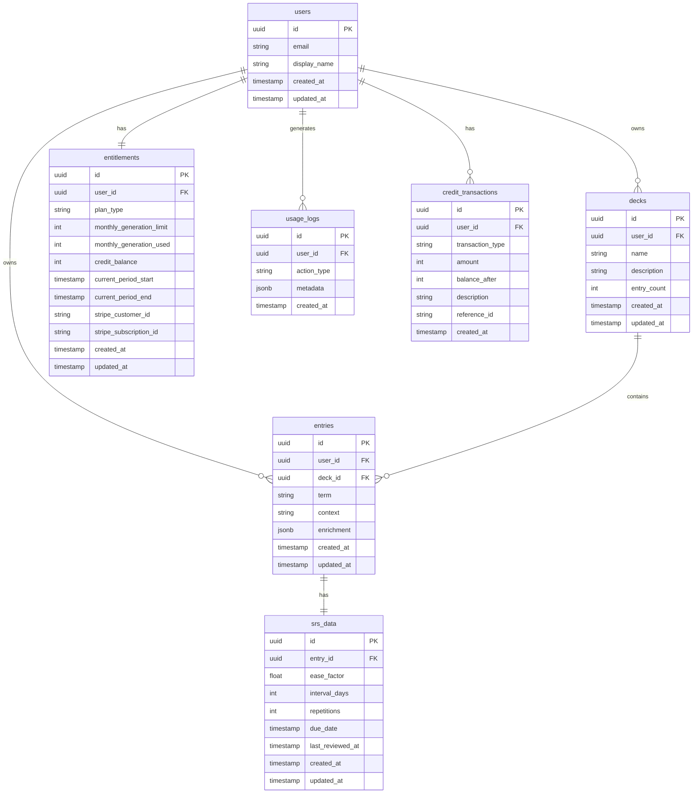

# 04. Data Model

## ER図



---

## テーブル定義

### users
Supabase Auth が管理するテーブル（`auth.users`）。追加フィールドは `public.profiles` で管理。

```sql
-- public.profiles テーブル
CREATE TABLE profiles (
  id UUID PRIMARY KEY REFERENCES auth.users(id) ON DELETE CASCADE,
  email TEXT NOT NULL,
  display_name TEXT,
  avatar_url TEXT,
  created_at TIMESTAMPTZ DEFAULT NOW(),
  updated_at TIMESTAMPTZ DEFAULT NOW()
);

-- トリガー: auth.users 作成時に自動で profiles を作成
CREATE OR REPLACE FUNCTION handle_new_user()
RETURNS TRIGGER AS $$
BEGIN
  INSERT INTO public.profiles (id, email, display_name)
  VALUES (NEW.id, NEW.email, COALESCE(NEW.raw_user_meta_data->>'full_name', split_part(NEW.email, '@', 1)));
  RETURN NEW;
END;
$$ LANGUAGE plpgsql SECURITY DEFINER;

CREATE TRIGGER on_auth_user_created
  AFTER INSERT ON auth.users
  FOR EACH ROW EXECUTE FUNCTION handle_new_user();
```

### entitlements

```sql
CREATE TABLE entitlements (
  id UUID PRIMARY KEY DEFAULT gen_random_uuid(),
  user_id UUID NOT NULL REFERENCES auth.users(id) ON DELETE CASCADE,

  -- プラン情報
  plan_type TEXT NOT NULL DEFAULT 'free' CHECK (plan_type IN ('free', 'plus')),

  -- 月間生成制限
  monthly_generation_limit INT NOT NULL DEFAULT 20,
  monthly_generation_used INT NOT NULL DEFAULT 0,

  -- クレジット残高
  credit_balance INT NOT NULL DEFAULT 0,

  -- 課金期間
  current_period_start TIMESTAMPTZ,
  current_period_end TIMESTAMPTZ,

  -- Stripe連携
  stripe_customer_id TEXT UNIQUE,
  stripe_subscription_id TEXT UNIQUE,

  -- タイムスタンプ
  created_at TIMESTAMPTZ DEFAULT NOW(),
  updated_at TIMESTAMPTZ DEFAULT NOW(),

  UNIQUE(user_id)
);

-- インデックス
CREATE INDEX idx_entitlements_user_id ON entitlements(user_id);
CREATE INDEX idx_entitlements_stripe_customer ON entitlements(stripe_customer_id);

-- トリガー: ユーザー作成時に entitlements を自動作成
CREATE OR REPLACE FUNCTION create_user_entitlement()
RETURNS TRIGGER AS $$
BEGIN
  INSERT INTO entitlements (user_id, plan_type)
  VALUES (NEW.id, 'free');
  RETURN NEW;
END;
$$ LANGUAGE plpgsql SECURITY DEFINER;

CREATE TRIGGER on_profile_created
  AFTER INSERT ON profiles
  FOR EACH ROW EXECUTE FUNCTION create_user_entitlement();
```

### decks

```sql
CREATE TABLE decks (
  id UUID PRIMARY KEY DEFAULT gen_random_uuid(),
  user_id UUID NOT NULL REFERENCES auth.users(id) ON DELETE CASCADE,
  name TEXT NOT NULL,
  description TEXT,
  entry_count INT NOT NULL DEFAULT 0,
  created_at TIMESTAMPTZ DEFAULT NOW(),
  updated_at TIMESTAMPTZ DEFAULT NOW()
);

-- インデックス
CREATE INDEX idx_decks_user_id ON decks(user_id);

-- デフォルトDeck作成トリガー
CREATE OR REPLACE FUNCTION create_default_deck()
RETURNS TRIGGER AS $$
BEGIN
  INSERT INTO decks (user_id, name, description)
  VALUES (NEW.id, 'Default', 'デフォルトDeck');
  RETURN NEW;
END;
$$ LANGUAGE plpgsql SECURITY DEFINER;

CREATE TRIGGER on_profile_created_deck
  AFTER INSERT ON profiles
  FOR EACH ROW EXECUTE FUNCTION create_default_deck();
```

### entries

```sql
CREATE TABLE entries (
  id UUID PRIMARY KEY DEFAULT gen_random_uuid(),
  user_id UUID NOT NULL REFERENCES auth.users(id) ON DELETE CASCADE,
  deck_id UUID REFERENCES decks(id) ON DELETE SET NULL,
  term TEXT NOT NULL,
  context TEXT,

  -- AI生成結果（JSONB）
  enrichment JSONB,
  /*
  enrichment の構造:
  {
    "translation_ja": "日本語訳",
    "translation_en": "English translation",
    "summary": "3行要約",
    "examples": ["例文1", "例文2", "例文3"],
    "related_terms": ["関連語1", "関連語2", "関連語3"],
    "reference_links": [
      {"title": "タイトル", "url": "https://..."}
    ],
    "generated_at"?: "2025-01-01T00:00:00Z",
    "model"?: "gpt-4o-mini"
  }
  */

  created_at TIMESTAMPTZ DEFAULT NOW(),
  updated_at TIMESTAMPTZ DEFAULT NOW()
);

-- インデックス
CREATE INDEX idx_entries_user_id ON entries(user_id);
CREATE INDEX idx_entries_deck_id ON entries(deck_id);
CREATE INDEX idx_entries_term ON entries(term);
CREATE INDEX idx_entries_created_at ON entries(created_at DESC);

-- 全文検索インデックス（日本語対応）
CREATE INDEX idx_entries_term_search ON entries USING gin(to_tsvector('simple', term));
```

### srs_data

```sql
CREATE TABLE srs_data (
  id UUID PRIMARY KEY DEFAULT gen_random_uuid(),
  entry_id UUID NOT NULL REFERENCES entries(id) ON DELETE CASCADE,

  -- SM-2 パラメータ
  ease_factor REAL NOT NULL DEFAULT 2.5,  -- 難易度係数（1.3〜2.5）
  interval_days INT NOT NULL DEFAULT 0,    -- 次回復習までの日数
  repetitions INT NOT NULL DEFAULT 0,      -- 連続正解回数

  -- スケジュール
  due_date TIMESTAMPTZ NOT NULL DEFAULT NOW(),  -- 次回復習日
  last_reviewed_at TIMESTAMPTZ,

  created_at TIMESTAMPTZ DEFAULT NOW(),
  updated_at TIMESTAMPTZ DEFAULT NOW(),

  UNIQUE(entry_id)
);

-- インデックス
CREATE INDEX idx_srs_data_entry_id ON srs_data(entry_id);
CREATE INDEX idx_srs_data_due_date ON srs_data(due_date);

-- Entry作成時に自動でsrs_data作成
CREATE OR REPLACE FUNCTION create_srs_data()
RETURNS TRIGGER AS $$
BEGIN
  INSERT INTO srs_data (entry_id, due_date)
  VALUES (NEW.id, NOW());
  RETURN NEW;
END;
$$ LANGUAGE plpgsql SECURITY DEFINER;

CREATE TRIGGER on_entry_created
  AFTER INSERT ON entries
  FOR EACH ROW EXECUTE FUNCTION create_srs_data();
```

### usage_logs

```sql
CREATE TABLE usage_logs (
  id UUID PRIMARY KEY DEFAULT gen_random_uuid(),
  user_id UUID NOT NULL REFERENCES auth.users(id) ON DELETE CASCADE,
  action_type TEXT NOT NULL,
  /*
  action_type:
  - 'generation': AI生成
  - 'review': 復習完了
  - 'entry_create': Entry作成
  - 'entry_delete': Entry削除
  - 'deck_create': Deck作成
  */
  metadata JSONB,
  created_at TIMESTAMPTZ DEFAULT NOW()
);

-- インデックス
CREATE INDEX idx_usage_logs_user_id ON usage_logs(user_id);
CREATE INDEX idx_usage_logs_action_type ON usage_logs(action_type);
CREATE INDEX idx_usage_logs_created_at ON usage_logs(created_at DESC);

-- パーティション（将来対応）
-- 月ごとにパーティションを作成してパフォーマンス改善
```

### credit_transactions

```sql
CREATE TABLE credit_transactions (
  id UUID PRIMARY KEY DEFAULT gen_random_uuid(),
  user_id UUID NOT NULL REFERENCES auth.users(id) ON DELETE CASCADE,

  transaction_type TEXT NOT NULL CHECK (transaction_type IN ('purchase', 'consume', 'refund', 'bonus')),
  amount INT NOT NULL,           -- 正: 増加、負: 消費
  balance_after INT NOT NULL,    -- 取引後の残高

  description TEXT,
  reference_id TEXT,             -- Stripe Payment Intent ID など

  created_at TIMESTAMPTZ DEFAULT NOW()
);

-- インデックス
CREATE INDEX idx_credit_transactions_user_id ON credit_transactions(user_id);
CREATE INDEX idx_credit_transactions_created_at ON credit_transactions(created_at DESC);
```

---

## RLS（Row Level Security）方針

### 基本方針
- すべてのテーブルでRLSを有効化
- ユーザーは自分のデータのみアクセス可能
- Service Roleキーはサーバーサイドのみで使用

### ポリシー定義

```sql
-- profiles
ALTER TABLE profiles ENABLE ROW LEVEL SECURITY;

CREATE POLICY "Users can view own profile"
  ON profiles FOR SELECT
  USING (auth.uid() = id);

CREATE POLICY "Users can update own profile"
  ON profiles FOR UPDATE
  USING (auth.uid() = id);

-- entitlements
ALTER TABLE entitlements ENABLE ROW LEVEL SECURITY;

CREATE POLICY "Users can view own entitlements"
  ON entitlements FOR SELECT
  USING (auth.uid() = user_id);

-- entitlements の更新はサーバーサイド（service role）のみ

-- decks
ALTER TABLE decks ENABLE ROW LEVEL SECURITY;

CREATE POLICY "Users can view own decks"
  ON decks FOR SELECT
  USING (auth.uid() = user_id);

CREATE POLICY "Users can insert own decks"
  ON decks FOR INSERT
  WITH CHECK (auth.uid() = user_id);

CREATE POLICY "Users can update own decks"
  ON decks FOR UPDATE
  USING (auth.uid() = user_id);

CREATE POLICY "Users can delete own decks"
  ON decks FOR DELETE
  USING (auth.uid() = user_id);

-- entries
ALTER TABLE entries ENABLE ROW LEVEL SECURITY;

CREATE POLICY "Users can view own entries"
  ON entries FOR SELECT
  USING (auth.uid() = user_id);

CREATE POLICY "Users can insert own entries"
  ON entries FOR INSERT
  WITH CHECK (auth.uid() = user_id);

CREATE POLICY "Users can update own entries"
  ON entries FOR UPDATE
  USING (auth.uid() = user_id);

CREATE POLICY "Users can delete own entries"
  ON entries FOR DELETE
  USING (auth.uid() = user_id);

-- srs_data (entries経由でアクセス)
ALTER TABLE srs_data ENABLE ROW LEVEL SECURITY;

CREATE POLICY "Users can view own srs_data"
  ON srs_data FOR SELECT
  USING (
    EXISTS (
      SELECT 1 FROM entries
      WHERE entries.id = srs_data.entry_id
      AND entries.user_id = auth.uid()
    )
  );

CREATE POLICY "Users can update own srs_data"
  ON srs_data FOR UPDATE
  USING (
    EXISTS (
      SELECT 1 FROM entries
      WHERE entries.id = srs_data.entry_id
      AND entries.user_id = auth.uid()
    )
  );

-- usage_logs
ALTER TABLE usage_logs ENABLE ROW LEVEL SECURITY;

CREATE POLICY "Users can view own usage_logs"
  ON usage_logs FOR SELECT
  USING (auth.uid() = user_id);

-- usage_logs の INSERT はサーバーサイドのみ

-- credit_transactions
ALTER TABLE credit_transactions ENABLE ROW LEVEL SECURITY;

CREATE POLICY "Users can view own credit_transactions"
  ON credit_transactions FOR SELECT
  USING (auth.uid() = user_id);

-- credit_transactions の INSERT はサーバーサイドのみ
```

---

## ビュー定義

### v_entries_with_srs

```sql
CREATE VIEW v_entries_with_srs AS
SELECT
  e.id,
  e.user_id,
  e.deck_id,
  e.term,
  e.context,
  e.enrichment,
  e.created_at,
  e.updated_at,
  s.ease_factor,
  s.interval_days,
  s.repetitions,
  s.due_date,
  s.last_reviewed_at,
  d.name AS deck_name
FROM entries e
JOIN srs_data s ON e.id = s.entry_id
LEFT JOIN decks d ON e.deck_id = d.id;
```

### v_due_entries

```sql
CREATE VIEW v_due_entries AS
SELECT *
FROM v_entries_with_srs
WHERE due_date <= NOW()
ORDER BY due_date ASC;
```

### v_user_stats

```sql
CREATE VIEW v_user_stats AS
SELECT
  p.id AS user_id,
  COUNT(DISTINCT e.id) AS total_entries,
  COUNT(DISTINCT CASE WHEN s.due_date <= NOW() THEN e.id END) AS due_entries,
  COUNT(DISTINCT d.id) AS total_decks,
  ent.plan_type,
  ent.monthly_generation_used,
  ent.monthly_generation_limit,
  ent.credit_balance
FROM profiles p
LEFT JOIN entries e ON p.id = e.user_id
LEFT JOIN srs_data s ON e.id = s.entry_id
LEFT JOIN decks d ON p.id = d.user_id
LEFT JOIN entitlements ent ON p.id = ent.user_id
GROUP BY p.id, ent.plan_type, ent.monthly_generation_used, ent.monthly_generation_limit, ent.credit_balance;
```

---

## マイグレーション戦略

### 初期セットアップ

```sql
-- 1. テーブル作成（上記の順序で）
-- 2. RLSポリシー適用
-- 3. ビュー作成
-- 4. トリガー作成
```

### 将来のマイグレーション

Supabase Migration を使用:

```bash
# マイグレーション作成
supabase migration new add_feature_x

# ローカル適用
supabase db reset

# 本番適用
supabase db push
```

---

## TypeScript 型定義

```typescript
// types/database.ts

export interface Profile {
  id: string;
  email: string;
  display_name: string | null;
  avatar_url: string | null;
  created_at: string;
  updated_at: string;
}

export interface Entitlement {
  id: string;
  user_id: string;
  plan_type: 'free' | 'plus';
  monthly_generation_limit: number;
  monthly_generation_used: number;
  credit_balance: number;
  current_period_start: string | null;
  current_period_end: string | null;
  stripe_customer_id: string | null;
  stripe_subscription_id: string | null;
  created_at: string;
  updated_at: string;
}

export interface Deck {
  id: string;
  user_id: string;
  name: string;
  description: string | null;
  entry_count: number;
  created_at: string;
  updated_at: string;
}

export interface Enrichment {
  translation_ja: string;
  translation_en: string;
  summary: string;
  examples: string[];
  related_terms: string[];
  reference_links: { title: string; url: string }[];
  generated_at: string;
  model: string;
}

export interface Entry {
  id: string;
  user_id: string;
  deck_id: string | null;
  term: string;
  context: string | null;
  enrichment: Enrichment | null;
  created_at: string;
  updated_at: string;
}

export interface SrsData {
  id: string;
  entry_id: string;
  ease_factor: number;
  interval_days: number;
  repetitions: number;
  due_date: string;
  last_reviewed_at: string | null;
  created_at: string;
  updated_at: string;
}

export interface EntryWithSrs extends Entry {
  ease_factor: number;
  interval_days: number;
  repetitions: number;
  due_date: string;
  last_reviewed_at: string | null;
  deck_name: string | null;
}

export interface UsageLog {
  id: string;
  user_id: string;
  action_type: 'generation' | 'review' | 'entry_create' | 'entry_delete' | 'deck_create';
  metadata: Record<string, unknown> | null;
  created_at: string;
}

export interface CreditTransaction {
  id: string;
  user_id: string;
  transaction_type: 'purchase' | 'consume' | 'refund' | 'bonus';
  amount: number;
  balance_after: number;
  description: string | null;
  reference_id: string | null;
  created_at: string;
}
```

---

## 関連ドキュメント

- [03_architecture_web.md](./03_architecture_web.md) - アーキテクチャ
- [05_api_design.md](./05_api_design.md) - API設計
- [07_srs_design.md](./07_srs_design.md) - SRSアルゴリズム
- [08_billing_entitlements.md](./08_billing_entitlements.md) - 課金・権利管理
