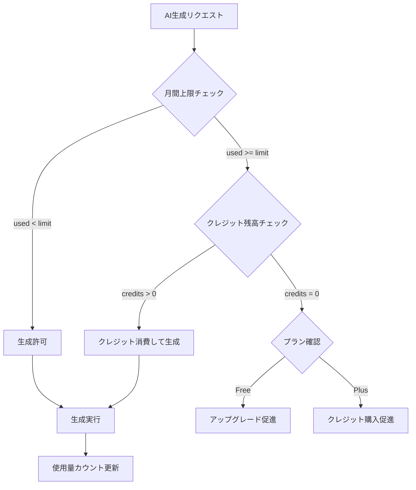

# 08. Billing & Entitlements

## 概要

### 決済プラットフォーム
| プラットフォーム | 決済システム | 用途 |
|-----------------|-------------|------|
| Web | **Stripe** | サブスク + クレジット |
| iOS | **App Store IAP** | サブスク + 消費型クレジット |
| Android | **Play Billing** | サブスク + 消費型クレジット |

### 統一原則
- **Entitlements（権利）をDBで一元管理**
- どの購入経路でも同じentitlementsテーブルを更新
- 機能制御はentitlementsの値で判定

---

## Entitlementsモデル

### プラン種別

| プラン | 月額 | AI生成/月 | Deck数 | クレジット購入 |
|--------|------|-----------|--------|--------------|
| **Free** | $0 | 20回 | 5 | 不可 |
| **Plus** | $4.99 | 200回 | 無制限 | 可能 |

### クレジットパック（Plus専用）

| パック | 価格 | クレジット数 | 単価 |
|--------|------|-------------|------|
| Small | $2.99 | 50 | $0.060 |
| Medium | $4.99 | 100 | $0.050 |
| Large | $9.99 | 250 | $0.040 |

### 制限値

```typescript
// lib/billing/limits.ts

export const PLAN_LIMITS = {
  free: {
    monthlyGenerationLimit: 20,
    maxDecks: 5,
    canPurchaseCredits: false
  },
  plus: {
    monthlyGenerationLimit: 200,
    maxDecks: Infinity,
    canPurchaseCredits: true
  }
} as const

export const CREDIT_PACKS = {
  small: { credits: 50, priceId: 'price_credits_50' },
  medium: { credits: 100, priceId: 'price_credits_100' },
  large: { credits: 250, priceId: 'price_credits_250' }
} as const
```

---

## 権利判定ロジック

### AI生成時の判定フロー



### 実装コード

```typescript
// lib/billing/entitlements.ts

import { createServerClient } from '@supabase/ssr'

export interface EntitlementCheck {
  allowed: boolean
  reason?: 'within_limit' | 'credit_consumed'
  error?: 'limit_exceeded' | 'no_credits'
  usage: {
    used: number
    limit: number
    remaining: number
    creditBalance: number
  }
}

export async function checkGenerationEntitlement(
  supabase: ReturnType<typeof createServerClient>,
  userId: string
): Promise<EntitlementCheck> {
  // Entitlements取得
  const { data: ent } = await supabase
    .from('entitlements')
    .select('*')
    .eq('user_id', userId)
    .single()

  if (!ent) {
    throw new Error('Entitlements not found')
  }

  const usage = {
    used: ent.monthly_generation_used,
    limit: ent.monthly_generation_limit,
    remaining: Math.max(0, ent.monthly_generation_limit - ent.monthly_generation_used),
    creditBalance: ent.credit_balance
  }

  // 月間上限内
  if (ent.monthly_generation_used < ent.monthly_generation_limit) {
    return { allowed: true, reason: 'within_limit', usage }
  }

  // クレジット消費可能
  if (ent.credit_balance > 0) {
    return { allowed: true, reason: 'credit_consumed', usage }
  }

  // 上限超過
  return {
    allowed: false,
    error: ent.plan_type === 'free' ? 'limit_exceeded' : 'no_credits',
    usage
  }
}

export async function consumeGeneration(userId: string): Promise<void> {
  const supabase = createServiceRoleClient()
  const { data, error } = await supabase
    .rpc('consume_generation_atomic', { p_user_id: userId })
    .single()

  if (error) {
    throw new Error(error.message)
  }

  if (!data?.success) {
    throw new Error(data?.message || 'Generation limit exceeded')
  }
}
```

### RPC関数（Supabase）

```sql
CREATE OR REPLACE FUNCTION consume_generation_atomic(p_user_id UUID)
RETURNS TABLE (
  success boolean,
  source text,
  remaining_monthly int,
  remaining_credits int,
  message text
) AS $$
DECLARE
  ent RECORD;
BEGIN
  SELECT * INTO ent
  FROM entitlements
  WHERE user_id = p_user_id
  FOR UPDATE;

  IF NOT FOUND THEN
    success := false;
    message := 'Entitlement not found';
    RETURN NEXT;
    RETURN;
  END IF;

  IF ent.monthly_generation_used < ent.monthly_generation_limit THEN
    UPDATE entitlements
    SET monthly_generation_used = monthly_generation_used + 1,
        updated_at = NOW()
    WHERE user_id = p_user_id;
    success := true;
    source := 'monthly';
    remaining_monthly := ent.monthly_generation_limit - ent.monthly_generation_used - 1;
    remaining_credits := ent.credit_balance;
    RETURN NEXT;
    RETURN;
  ELSIF ent.plan_type = 'plus' AND ent.credit_balance > 0 THEN
    UPDATE entitlements
    SET credit_balance = ent.credit_balance - 1,
        updated_at = NOW()
    WHERE user_id = p_user_id;
    INSERT INTO credit_transactions (user_id, transaction_type, amount, balance_after, description)
    VALUES (p_user_id, 'consume', -1, ent.credit_balance - 1, 'AI generation');
    success := true;
    source := 'credit';
    remaining_monthly := 0;
    remaining_credits := ent.credit_balance - 1;
    RETURN NEXT;
    RETURN;
  ELSE
    success := false;
    message := 'Generation limit exceeded';
    remaining_monthly := 0;
    remaining_credits := ent.credit_balance;
    RETURN NEXT;
    RETURN;
  END IF;
END;
$$ LANGUAGE plpgsql SECURITY DEFINER;
```

---

## Stripe統合

### 商品・価格設定

```typescript
// Stripe Dashboard または API で作成

// サブスクリプション
const plusSubscription = {
  product: 'TD2U Plus',
  prices: [
    {
      id: 'price_plus_monthly',
      unit_amount: 499, // $4.99
      currency: 'usd',
      recurring: { interval: 'month' }
    }
  ]
}

// クレジットパック（一回購入）
const creditPacks = [
  {
    product: 'TD2U Credits - 50',
    price: {
      id: 'price_credits_50',
      unit_amount: 299, // $2.99
      currency: 'usd'
    }
  },
  {
    product: 'TD2U Credits - 100',
    price: {
      id: 'price_credits_100',
      unit_amount: 499,
      currency: 'usd'
    }
  },
  {
    product: 'TD2U Credits - 250',
    price: {
      id: 'price_credits_250',
      unit_amount: 999,
      currency: 'usd'
    }
  }
]
```

### Checkout Session作成

```typescript
// app/api/billing/checkout/route.ts

import Stripe from 'stripe'

const stripe = new Stripe(process.env.STRIPE_SECRET_KEY!)

export async function POST(request: Request) {
  const supabase = createServerClient(/* ... */)
  const { data: { user } } = await supabase.auth.getUser()

  if (!user) {
    return Response.json({ error: 'UNAUTHORIZED' }, { status: 401 })
  }

  const { price_id, mode } = await request.json()

  // Stripe Customer取得または作成
  const { data: ent } = await supabase
    .from('entitlements')
    .select('stripe_customer_id')
    .eq('user_id', user.id)
    .single()

  let customerId = ent?.stripe_customer_id

  if (!customerId) {
    const customer = await stripe.customers.create({
      email: user.email,
      metadata: { user_id: user.id }
    })
    customerId = customer.id

    await supabase.from('entitlements').update({
      stripe_customer_id: customerId
    }).eq('user_id', user.id)
  }

  // Checkout Session作成
  const session = await stripe.checkout.sessions.create({
    customer: customerId,
    mode: mode, // 'subscription' or 'payment'
    line_items: [{ price: price_id, quantity: 1 }],
    success_url: `${process.env.NEXT_PUBLIC_APP_URL}/checkout/success?session_id={CHECKOUT_SESSION_ID}`,
    cancel_url: `${process.env.NEXT_PUBLIC_APP_URL}/checkout/cancel`,
    metadata: { user_id: user.id }
  })

  return Response.json({ data: { checkout_url: session.url } })
}
```

### Webhook処理

```typescript
// app/api/webhooks/stripe/route.ts

import Stripe from 'stripe'

const stripe = new Stripe(process.env.STRIPE_SECRET_KEY!)
const webhookSecret = process.env.STRIPE_WEBHOOK_SECRET!

export async function POST(request: Request) {
  const body = await request.text()
  const signature = request.headers.get('stripe-signature')!

  let event: Stripe.Event

  try {
    event = stripe.webhooks.constructEvent(body, signature, webhookSecret)
  } catch (err) {
    return Response.json({ error: 'Invalid signature' }, { status: 400 })
  }

  const supabase = createServiceRoleClient() // Service Role使用

  switch (event.type) {
    case 'checkout.session.completed': {
      const session = event.data.object as Stripe.Checkout.Session
      await handleCheckoutCompleted(supabase, session)
      break
    }

    case 'customer.subscription.created':
    case 'customer.subscription.updated': {
      const subscription = event.data.object as Stripe.Subscription
      await handleSubscriptionChange(supabase, subscription)
      break
    }

    case 'customer.subscription.deleted': {
      const subscription = event.data.object as Stripe.Subscription
      await handleSubscriptionCanceled(supabase, subscription)
      break
    }

    case 'invoice.paid': {
      const invoice = event.data.object as Stripe.Invoice
      await handleInvoicePaid(supabase, invoice)
      break
    }

    case 'invoice.payment_failed': {
      const invoice = event.data.object as Stripe.Invoice
      await handlePaymentFailed(supabase, invoice)
      break
    }
  }

  return Response.json({ received: true })
}

async function handleCheckoutCompleted(
  supabase: any,
  session: Stripe.Checkout.Session
) {
  const userId = session.metadata?.user_id
  if (!userId) return

  if (session.mode === 'payment') {
    // クレジット購入
    const lineItems = await stripe.checkout.sessions.listLineItems(session.id)
    const priceId = lineItems.data[0]?.price?.id

    const creditAmount = getCreditAmountFromPriceId(priceId)

    // 現在の残高取得
    const { data: ent } = await supabase
      .from('entitlements')
      .select('credit_balance')
      .eq('user_id', userId)
      .single()

    const newBalance = ent.credit_balance + creditAmount

    // クレジット追加
    await supabase.from('entitlements').update({
      credit_balance: newBalance,
      updated_at: new Date().toISOString()
    }).eq('user_id', userId)

    // 取引記録
    await supabase.from('credit_transactions').insert({
      user_id: userId,
      transaction_type: 'purchase',
      amount: creditAmount,
      balance_after: newBalance,
      description: `Purchased ${creditAmount} credits`,
      reference_id: session.payment_intent as string
    })
  }
}

async function handleSubscriptionChange(
  supabase: any,
  subscription: Stripe.Subscription
) {
  const customerId = subscription.customer as string

  // Customer IDからユーザー特定
  const { data: ent } = await supabase
    .from('entitlements')
    .select('user_id')
    .eq('stripe_customer_id', customerId)
    .single()

  if (!ent) return

  const isActive = subscription.status === 'active'

  await supabase.from('entitlements').update({
    plan_type: isActive ? 'plus' : 'free',
    monthly_generation_limit: isActive ? 200 : 20,
    stripe_subscription_id: subscription.id,
    current_period_start: new Date(subscription.current_period_start * 1000).toISOString(),
    current_period_end: new Date(subscription.current_period_end * 1000).toISOString(),
    updated_at: new Date().toISOString()
  }).eq('user_id', ent.user_id)
}

async function handleSubscriptionCanceled(
  supabase: any,
  subscription: Stripe.Subscription
) {
  const customerId = subscription.customer as string

  const { data: ent } = await supabase
    .from('entitlements')
    .select('user_id')
    .eq('stripe_customer_id', customerId)
    .single()

  if (!ent) return

  // Freeプランに戻す
  await supabase.from('entitlements').update({
    plan_type: 'free',
    monthly_generation_limit: 20,
    stripe_subscription_id: null,
    current_period_start: null,
    current_period_end: null,
    updated_at: new Date().toISOString()
  }).eq('user_id', ent.user_id)
}

function getCreditAmountFromPriceId(priceId: string | undefined): number {
  switch (priceId) {
    case 'price_credits_50': return 50
    case 'price_credits_100': return 100
    case 'price_credits_250': return 250
    default: return 0
  }
}
```

### Customer Portal

```typescript
// app/api/billing/portal/route.ts

export async function POST(request: Request) {
  const supabase = createServerClient(/* ... */)
  const { data: { user } } = await supabase.auth.getUser()

  const { data: ent } = await supabase
    .from('entitlements')
    .select('stripe_customer_id')
    .eq('user_id', user!.id)
    .single()

  if (!ent?.stripe_customer_id) {
    return Response.json({ error: 'No billing account' }, { status: 400 })
  }

  const session = await stripe.billingPortal.sessions.create({
    customer: ent.stripe_customer_id,
    return_url: `${process.env.NEXT_PUBLIC_APP_URL}/settings`
  })

  return Response.json({ data: { portal_url: session.url } })
}
```

---

## モバイル課金（将来）

### iOS (App Store IAP)

```typescript
// 将来実装: app/api/webhooks/apple/route.ts

// App Store Server Notifications v2 を受信
// https://developer.apple.com/documentation/appstoreservernotifications

interface AppleNotification {
  notificationType: string
  subtype?: string
  signedTransactionInfo: string
  signedRenewalInfo?: string
}

export async function POST(request: Request) {
  const notification = await request.json()

  // JWS署名検証
  const transactionInfo = await verifyAndDecodeTransaction(
    notification.signedTransactionInfo
  )

  switch (notification.notificationType) {
    case 'SUBSCRIBED':
      // サブスク開始 → entitlements更新
      break
    case 'DID_RENEW':
      // 更新 → 期間延長
      break
    case 'EXPIRED':
    case 'DID_FAIL_TO_RENEW':
      // 失効 → Freeに戻す
      break
    case 'CONSUMPTION_REQUEST':
      // 消費型（クレジット）購入
      break
  }

  return Response.json({ received: true })
}
```

### Android (Play Billing)

```typescript
// 将来実装: app/api/webhooks/google/route.ts

// Google Cloud Pub/Sub で受信
// https://developer.android.com/google/play/billing/getting-ready

interface GoogleNotification {
  subscriptionNotification?: {
    notificationType: number
    purchaseToken: string
    subscriptionId: string
  }
  oneTimeProductNotification?: {
    notificationType: number
    purchaseToken: string
    sku: string
  }
}

export async function POST(request: Request) {
  const message = await request.json()
  const notification = JSON.parse(
    Buffer.from(message.message.data, 'base64').toString()
  )

  // Google Play Developer API でレシート検証
  // entitlements更新

  return Response.json({ received: true })
}
```

---

## 月次リセット

### Supabase Cron（pg_cron）

```sql
-- 毎月1日 00:00 UTC にリセット
SELECT cron.schedule(
  'reset-monthly-usage',
  '0 0 1 * *',
  $$
  UPDATE entitlements
  SET
    monthly_generation_used = 0,
    current_period_start = NOW(),
    current_period_end = NOW() + INTERVAL '1 month',
    updated_at = NOW()
  WHERE plan_type = 'plus'
    AND stripe_subscription_id IS NOT NULL;

  -- Freeユーザーもリセット
  UPDATE entitlements
  SET
    monthly_generation_used = 0,
    updated_at = NOW()
  WHERE plan_type = 'free';
  $$
);
```

---

## 冪等性・整合性

### Webhook冪等性

```typescript
// Webhookイベントを記録して重複処理防止
const processedEvents = new Set<string>()

async function processWebhookIdempotently(
  eventId: string,
  handler: () => Promise<void>
) {
  // DB記録確認
  const { data: existing } = await supabase
    .from('webhook_events')
    .select('id')
    .eq('event_id', eventId)
    .single()

  if (existing) {
    console.log(`Event ${eventId} already processed`)
    return
  }

  // 処理実行
  await handler()

  // イベント記録
  await supabase.from('webhook_events').insert({
    event_id: eventId,
    processed_at: new Date().toISOString()
  })
}
```

### クレジット残高整合性

```typescript
// トランザクション使用
async function consumeCreditSafely(userId: string): Promise<boolean> {
  const { data, error } = await supabase.rpc('consume_credit_atomic', {
    p_user_id: userId
  })

  return data?.success ?? false
}
```

```sql
CREATE OR REPLACE FUNCTION consume_credit_atomic(p_user_id UUID)
RETURNS jsonb AS $$
DECLARE
  v_balance INT;
BEGIN
  -- 排他ロック
  SELECT credit_balance INTO v_balance
  FROM entitlements
  WHERE user_id = p_user_id
  FOR UPDATE;

  IF v_balance <= 0 THEN
    RETURN jsonb_build_object('success', false, 'reason', 'insufficient_credits');
  END IF;

  -- 残高更新
  UPDATE entitlements
  SET credit_balance = credit_balance - 1, updated_at = NOW()
  WHERE user_id = p_user_id;

  -- 取引記録
  INSERT INTO credit_transactions (user_id, transaction_type, amount, balance_after)
  VALUES (p_user_id, 'consume', -1, v_balance - 1);

  RETURN jsonb_build_object('success', true, 'new_balance', v_balance - 1);
END;
$$ LANGUAGE plpgsql;
```

---

## 関連ドキュメント

- [04_data_model.md](./04_data_model.md) - データモデル
- [05_api_design.md](./05_api_design.md) - API設計
- [09_business_model_unit_economics.md](./09_business_model_unit_economics.md) - ビジネスモデル
- [12_mobile_plan.md](./12_mobile_plan.md) - モバイル展開計画
