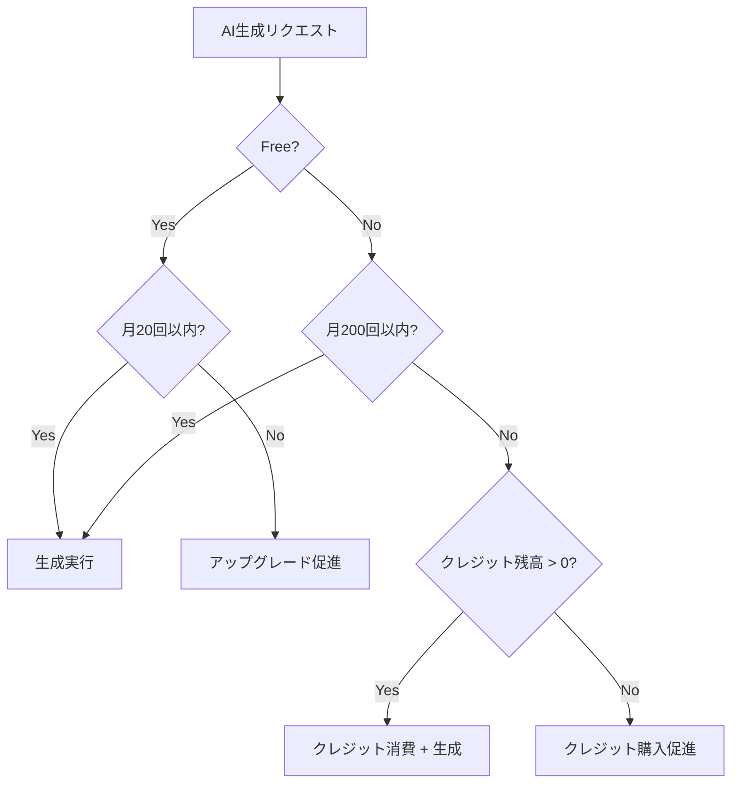

# 09. Business Model & Unit Economics

## プラン設計

### プラン比較表

| 項目 | Free | Plus |
|------|------|------|
| **月額** | $0 | $4.99 |
| **AI生成/月** | 20回 | 200回 |
| **Entry登録** | 無制限 | 無制限 |
| **SRS復習** | 無制限 | 無制限 |
| **Deck数** | 5 | 無制限 |
| **クレジット購入** | 不可 | 可能 |
| **優先サポート** | なし | メール |

### クレジットパック（Plus専用）

| パック | 価格 | クレジット | 単価 | 想定用途 |
|--------|------|-----------|------|---------|
| Small | $2.99 | 50 | $0.060 | ライトユーザー |
| Medium | $4.99 | 100 | $0.050 | 標準 |
| Large | $9.99 | 250 | $0.040 | ヘビーユーザー |

### 価格設定の根拠

1. **競合比較**
   - Anki: 無料（Web）, iOS $24.99（買い切り）
   - Quizlet: $35.99/年（Plus）
   - Notion AI: $10/月

2. **心理的価格帯**
   - $4.99: スターバックス1杯分
   - 年間 $59.88: 競合より安価

3. **A/Bテスト予定**
   - テスト範囲: $3.99 - $7.99
   - 変数: 価格、AI生成上限

---

## 収益ドライバー

### 収益構成

```
Total Revenue = Subscription Revenue + Credit Revenue

Subscription Revenue = Plus Users × $4.99 × Retention Rate
Credit Revenue = Credit Purchases × Credit Price
```

### 主要指標

| 指標 | 定義 | 目標値 |
|------|------|--------|
| **CVR (Free→Plus)** | Plus転換率 | 3-5% |
| **ARPU** | ユーザーあたり月間収益 | $0.20-0.50 |
| **ARPPU** | 有料ユーザーあたり収益 | $5.50-7.00 |
| **Monthly Churn** | 月間解約率 | < 5% |
| **LTV** | 顧客生涯価値 | $50-100 |

### 収益シミュレーション

#### シナリオ: 1000 MAU（3ヶ月後）

| 項目 | 数値 | 計算 |
|------|------|------|
| MAU | 1,000 | - |
| Plus CVR | 3% | - |
| Plus Users | 30 | 1000 × 3% |
| Subscription MRR | $149.70 | 30 × $4.99 |
| Credit購入率 | 20% | Plus内 |
| Credit購入者 | 6 | 30 × 20% |
| Credit MRR | $29.94 | 6 × $4.99 |
| **Total MRR** | **$179.64** | - |
| **ARR** | **$2,155.68** | MRR × 12 |

#### シナリオ: 10,000 MAU（1年後）

| 項目 | 数値 |
|------|------|
| MAU | 10,000 |
| Plus Users (4%) | 400 |
| Subscription MRR | $1,996 |
| Credit MRR | $300 |
| **Total MRR** | **$2,296** |
| **ARR** | **$27,552** |

---

## コスト構造

### 変動費（Variable Costs）

| 項目 | 単価 | 備考 |
|------|------|------|
| **LLM (GPT-4o-mini)** | $0.002/生成 | 入力500 + 出力1000トークン |
| **Stripe手数料** | 2.9% + $0.30 | 決済ごと |
| **App Store手数料** | 15-30% | iOS売上 |
| **Play Store手数料** | 15-30% | Android売上 |

### 固定費（Fixed Costs）

| 項目 | 月額 | 備考 |
|------|------|------|
| **Supabase Pro** | $25 | 〜10万MAUまで |
| **Vercel Pro** | $20 | 必要に応じて |
| **ドメイン** | $1.5 | 年$18 |
| **その他** | $10 | エラー監視等 |
| **合計** | **~$56.5** | - |

### LLMコスト詳細

```
GPT-4o-mini 価格:
- Input: $0.15 / 1M tokens
- Output: $0.60 / 1M tokens

1生成あたり:
- Input: 500 tokens → $0.000075
- Output: 1000 tokens → $0.0006
- Total: $0.000675 ≈ $0.0007/生成

月間コスト (Plus 200回フル使用):
- 200 × $0.0007 = $0.14/ユーザー
```

---

## 原価ガード (Cost Protection)

### LLMコスト超過防止



### 収支バランス

| プラン | 月間生成 | LLMコスト | 売上 | 粗利 | 粗利率 |
|--------|---------|----------|------|------|--------|
| Free | 20 | $0.014 | $0 | -$0.014 | - |
| Plus (軽) | 50 | $0.035 | $4.99 | $4.96 | 99.3% |
| Plus (中) | 100 | $0.07 | $4.99 | $4.92 | 98.6% |
| Plus (重) | 200 | $0.14 | $4.99 | $4.85 | 97.2% |
| Plus (超過+credit) | 250 | $0.175 | $4.99+$2.99 | $7.81 | 97.8% |

### 原価ガードの仕組み

1. **無料枠の制限**: 月20回で損失を限定（~$0.014/user）
2. **Plus上限**: 月200回で収益性を維持（最悪でも97%粗利）
3. **クレジット制**: 超過分はユーザー負担（追加収益）
4. **レート制限**: API乱用防止（10 req/min）

---

## 粗利計算式

### 月間粗利

```
Gross Profit = Revenue - Variable Costs

Revenue = (Plus Users × $4.99) + (Credit Revenue)

Variable Costs =
  + LLM Cost (Total Generations × $0.0007)
  + Stripe Fee (Revenue × 2.9% + $0.30 per transaction)
  + App Store Fee (Mobile Revenue × 15-30%)
```

### ユーザーあたり粗利

```typescript
interface UserEconomics {
  plan: 'free' | 'plus'
  monthlyGenerations: number
  creditsPurchased: number
}

function calculateUserGrossProfit(user: UserEconomics): number {
  // 収益
  let revenue = 0
  if (user.plan === 'plus') {
    revenue += 4.99
  }
  revenue += user.creditsPurchased * 0.05 // 平均単価

  // コスト
  const llmCost = user.monthlyGenerations * 0.0007
  const stripeFee = revenue > 0 ? revenue * 0.029 + 0.30 : 0

  return revenue - llmCost - stripeFee
}

// 例
// Free: generations=20 → -$0.014 (赤字)
// Plus軽: generations=50 → $4.99 - $0.035 - $0.44 = $4.52
// Plus重: generations=200 → $4.99 - $0.14 - $0.44 = $4.41
```

---

## 価格案（A/Bテスト前提）

### テスト候補

| バリアント | Plus月額 | AI生成/月 | 想定CVR |
|-----------|---------|-----------|---------|
| A (現行) | $4.99 | 200 | 3% |
| B (低価格) | $3.99 | 150 | 4% |
| C (高価格) | $6.99 | 300 | 2% |

### 想定収益比較（1000 MAU）

| バリアント | Plus Users | MRR | 備考 |
|-----------|-----------|-----|------|
| A | 30 | $149.70 | ベースライン |
| B | 40 | $159.60 | CVR勝ち |
| C | 20 | $139.80 | ARPU勝ち |

### テスト実施計画

1. **Phase 1**: A vs B（価格感度テスト）
2. **Phase 2**: 勝者 vs C（ARPU最大化テスト）
3. **判定基準**: MRR最大化（CVR × 価格）

---

## LTV/CAC分析

### LTV計算

```
LTV = ARPU × Average Lifetime

Average Lifetime = 1 / Monthly Churn Rate

例:
- ARPU (Plus): $5.50
- Monthly Churn: 5%
- Average Lifetime: 20ヶ月
- LTV: $110
```

### CAC目標

```
Target LTV:CAC Ratio = 3:1

LTV = $110
Target CAC = $110 / 3 = $36.67
```

### 獲得チャネル別CAC（想定）

| チャネル | 想定CAC | 備考 |
|---------|--------|------|
| オーガニック（SEO） | $0-5 | コンテンツ制作コスト |
| 口コミ | $0 | 紹介機能実装後 |
| Twitter/X広告 | $20-40 | テスト予定 |
| Google広告 | $30-50 | 高コスト |

---

## 損益分岐点

### 固定費回収

```
Break-even Point = Fixed Costs / Gross Margin per Plus User

Fixed Costs = $56.5/月
Gross Margin/User = $4.41 (200生成時)
Break-even = 56.5 / 4.41 = 13 Plus Users

→ 13人のPlus会員で固定費カバー
→ CVR 3%なら MAU 433人で損益分岐
```

### 段階別目標

| フェーズ | MAU | Plus Users | MRR | 状態 |
|---------|-----|-----------|-----|------|
| β | 100 | 3 | $15 | 赤字 |
| 損益分岐 | 500 | 15 | $75 | ±0 |
| 黒字化 | 1,000 | 30 | $150 | 黒字 |
| 成長 | 10,000 | 400 | $2,000 | 安定 |

---

## リスクと対策

### コストリスク

| リスク | 影響 | 対策 |
|--------|------|------|
| LLM価格上昇 | 粗利低下 | プロバイダ切替、キャッシュ |
| Supabase制限 | サービス停止 | 早期Pro plan移行 |
| Stripe手数料 | 粗利低下 | 年間プラン推奨（取引数削減） |

### 収益リスク

| リスク | 影響 | 対策 |
|--------|------|------|
| 低CVR | MRR未達 | 価格A/B、機能改善 |
| 高Churn | LTV低下 | オンボーディング強化 |
| 競合出現 | シェア低下 | 差別化機能強化 |

---

## KPIダッシュボード（将来）

### 監視指標

```typescript
interface BusinessMetrics {
  // 収益
  mrr: number
  arr: number
  arpu: number
  arppu: number

  // 転換
  signupToFreeRate: number
  freeToPlusRate: number
  creditPurchaseRate: number

  // リテンション
  monthlyChurn: number
  netRevenueRetention: number

  // コスト
  llmCostPerUser: number
  cac: number
  ltvCacRatio: number
}
```

---

## 関連ドキュメント

- [08_billing_entitlements.md](./08_billing_entitlements.md) - 課金・権利管理
- [10_metrics_growth.md](./10_metrics_growth.md) - メトリクス・グロース
- [11_roadmap.md](./11_roadmap.md) - ロードマップ
