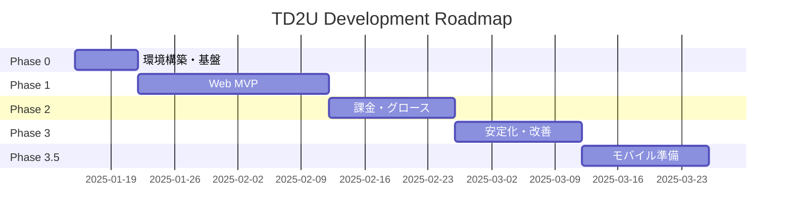
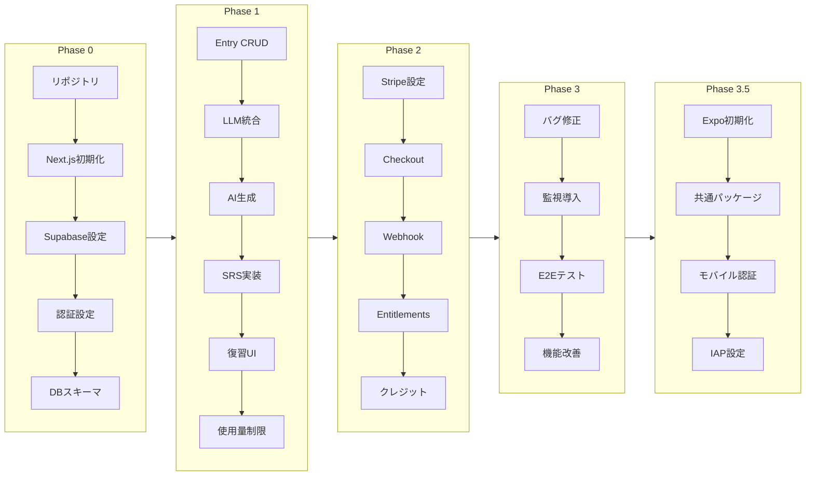

# 11. Roadmap

## フェーズ概要

---

## Phase 0: 環境構築・基盤（1週間）

### 目標
開発環境とプロジェクト基盤を整備し、チーム（個人）が即座に開発開始できる状態にする。

### タスク

| タスク | DoD（完了条件） | 優先度 |
|--------|----------------|--------|
| リポジトリ作成 | GitHub repo + README | P0 |
| Next.js プロジェクト初期化 | `npm run dev` で起動 | P0 |
| Supabase プロジェクト作成 | DB接続確認 | P0 |
| 認証設定 | Email + Google OAuth動作 | P0 |
| DBスキーマ作成 | 全テーブル + RLS適用 | P0 |
| 環境変数設定 | .env.example 完備 | P0 |
| CI/CD設定 | Vercel自動デプロイ | P1 |
| ESLint/Prettier設定 | lint通過 | P1 |

### 成果物
- `/` でNext.jsのデフォルトページ表示
- Supabase Auth でログイン/ログアウト可能
- 全テーブルがDBに存在

### リスク
| リスク | 対策 |
|--------|------|
| Supabase設定ミス | 公式チュートリアル準拠 |
| 環境変数漏れ | .env.example でチェックリスト化 |

---

## Phase 1: Web MVP（3週間）

### 目標
コア機能（Entry登録 + AI生成 + SRS復習）が動作するWebアプリをリリース。

### Week 1: 基本機能

| タスク | DoD | 優先度 |
|--------|-----|--------|
| ランディングページ | LP表示、CTA動作 | P0 |
| ログイン/サインアップUI | 認証フロー完了 | P0 |
| ダッシュボードUI | Entry一覧表示 | P0 |
| Entry CRUD API | 作成・取得・更新・削除 | P0 |
| Entry作成画面 | フォーム動作 | P0 |

### Week 2: AI生成 + 復習

| タスク | DoD | 優先度 |
|--------|-----|--------|
| LLMプロバイダ実装 | OpenAI呼び出し成功 | P0 |
| Enrichment API | AI生成レスポンス | P0 |
| Entry作成 + AI生成連携 | 生成結果をEntryに保存 | P0 |
| SRS計算ロジック | SM-2実装 + テスト | P0 |
| 復習画面UI | フラッシュカード表示 | P0 |
| 復習API | SRS更新動作 | P0 |

### Week 3: 仕上げ

| タスク | DoD | 優先度 |
|--------|-----|--------|
| Deck管理 | CRUD + Entry紐付け | P1 |
| 統計ダッシュボード | 基本統計表示 | P1 |
| 使用量制限（Free） | 月20回制限動作 | P0 |
| エラーハンドリング | 全APIでエラー処理 | P0 |
| レスポンシブ対応 | モバイルブラウザ対応 | P1 |
| βリリース | Vercelデプロイ完了 | P0 |

### 成果物
- `https://td2u.vercel.app` でアプリ利用可能
- 新規ユーザーがEntry作成→AI生成→復習の一連フロー完了
- Free制限（月20回）が機能

### DoD（Phase 1 完了条件）
- [ ] 新規ユーザーがサインアップできる
- [ ] Entryを作成してAI Enrichmentを生成できる
- [ ] SRS復習が機能する（難易度選択で間隔更新）
- [ ] 月20回の生成制限が機能する
- [ ] エラー時に適切なメッセージが表示される

### リスク
| リスク | 影響 | 対策 |
|--------|------|------|
| LLM出力不安定 | UX低下 | リトライ + バリデーション |
| SRS計算バグ | 学習効果低下 | 単体テスト徹底 |
| 認証トラブル | ユーザー離脱 | Supabase公式パターン準拠 |

---

## Phase 2: 課金・グロース（2週間）

### 目標
Stripe決済を導入し、収益化の基盤を確立。

### Week 4: 決済基盤

| タスク | DoD | 優先度 |
|--------|-----|--------|
| Stripe商品/価格設定 | Dashboard設定完了 | P0 |
| Checkout Session API | 決済フロー動作 | P0 |
| Webhook処理 | subscription更新 | P0 |
| entitlements連携 | Plus権限付与 | P0 |
| 料金ページUI | プラン比較表示 | P0 |

### Week 5: クレジット + グロース

| タスク | DoD | 優先度 |
|--------|-----|--------|
| クレジット購入 | 一回決済動作 | P0 |
| クレジット消費 | 上限超過時消費 | P0 |
| Customer Portal | サブスク管理可能 | P1 |
| アナリティクス導入 | イベント計測開始 | P1 |
| SEO基盤 | メタタグ、sitemap | P1 |

### 成果物
- PlusプランにStripe経由でアップグレード可能
- クレジット購入・消費が機能
- 基本的なアナリティクス計測開始

### DoD（Phase 2 完了条件）
- [ ] Stripe Checkoutで決済完了できる
- [ ] 決済後にPlusプランが反映される
- [ ] Plus上限超過時にクレジット消費できる
- [ ] Customer Portalでサブスク管理できる
- [ ] 主要イベントが計測されている

### リスク
| リスク | 影響 | 対策 |
|--------|------|------|
| Webhook失敗 | 課金不整合 | 冪等性確保、手動復旧手順 |
| テスト不足 | 本番障害 | Stripe Test Mode徹底 |

---

## Phase 3: 安定化・改善（2週間）

### 目標
ユーザーフィードバックを元に改善し、サービスを安定稼働させる。

### Week 6: 品質向上

| タスク | DoD | 優先度 |
|--------|-----|--------|
| バグ修正 | 重大バグ0件 | P0 |
| パフォーマンス改善 | LCP < 3秒 | P1 |
| エラー監視導入 | Sentry設定 | P1 |
| ログ整備 | 構造化ログ出力 | P1 |
| E2Eテスト | 主要フロー自動テスト | P1 |

### Week 7: 機能改善

| タスク | DoD | 優先度 |
|--------|-----|--------|
| 検索機能 | Entry検索動作 | P1 |
| Enrichment再生成 | 再生成ボタン動作 | P2 |
| インポート/エクスポート | CSV対応 | P2 |
| ダークモード | テーマ切替 | P2 |
| Apple OAuth | iOS準備 | P1 |

### 成果物
- 安定稼働するサービス
- 基本的な検索機能
- エラー監視体制

### DoD（Phase 3 完了条件）
- [ ] 重大バグ0件
- [ ] Sentry/ログでエラー監視可能
- [ ] 主要フローのE2Eテスト通過
- [ ] 検索機能が動作する
- [ ] Apple OAuthが設定済み

---

## Phase 3.5: モバイル準備（2週間）

### 目標
React Native (Expo) でのモバイル開発準備を完了。

### Week 8: 基盤整備

| タスク | DoD | 優先度 |
|--------|-----|--------|
| Expoプロジェクト作成 | 初期化完了 | P0 |
| 共通パッケージ抽出 | types, utils共有 | P0 |
| Supabase SDK設定 | 認証動作 | P0 |
| 基本画面作成 | ログイン、ダッシュボード | P1 |

### Week 9: モバイル課金準備

| タスク | DoD | 優先度 |
|--------|-----|--------|
| IAP設定（App Store） | 商品登録 | P1 |
| Play Billing設定 | 商品登録 | P1 |
| モバイル課金API設計 | 仕様確定 | P1 |
| TestFlightビルド | テスト配布可能 | P1 |

### 成果物
- Expoプロジェクトでログイン可能
- IAP/Play Billing商品登録済み
- TestFlightでβテスト可能

### DoD（Phase 3.5 完了条件）
- [ ] Expoアプリでログインできる
- [ ] Entry一覧が表示される
- [ ] App Store / Play Store商品登録済み
- [ ] TestFlight配布可能

---

## 依存関係図

---

## 主要リスクと対策

| フェーズ | リスク | 影響度 | 対策 |
|---------|--------|--------|------|
| Phase 0 | Supabase設定ミス | 高 | 公式ドキュメント準拠、早期検証 |
| Phase 1 | LLM出力品質 | 中 | Few-shot改善、バリデーション |
| Phase 1 | SRS計算バグ | 高 | 徹底した単体テスト |
| Phase 2 | 決済トラブル | 高 | Test Mode検証、手動復旧手順 |
| Phase 3 | パフォーマンス | 中 | プロファイリング、最適化 |
| Phase 3.5 | App Store審査 | 中 | ガイドライン事前確認 |

---

## マイルストーン

| マイルストーン | 日付（目安） | 条件 |
|---------------|-------------|------|
| **M0: 開発環境Ready** | Week 1 | 認証動作、DB接続完了 |
| **M1: MVP βリリース** | Week 4 | 基本機能動作、限定公開 |
| **M2: 課金稼働** | Week 6 | Stripe決済動作 |
| **M3: 一般公開** | Week 8 | 安定稼働確認 |
| **M4: モバイルβ** | Week 10 | TestFlight配布 |

---

## 関連ドキュメント

- [01_prd.md](./01_prd.md) - PRD
- [09_business_model_unit_economics.md](./09_business_model_unit_economics.md) - ビジネスモデル
- [12_mobile_plan.md](./12_mobile_plan.md) - モバイル展開計画
- [TODO.md](../TODO.md) - 実装タスク一覧
