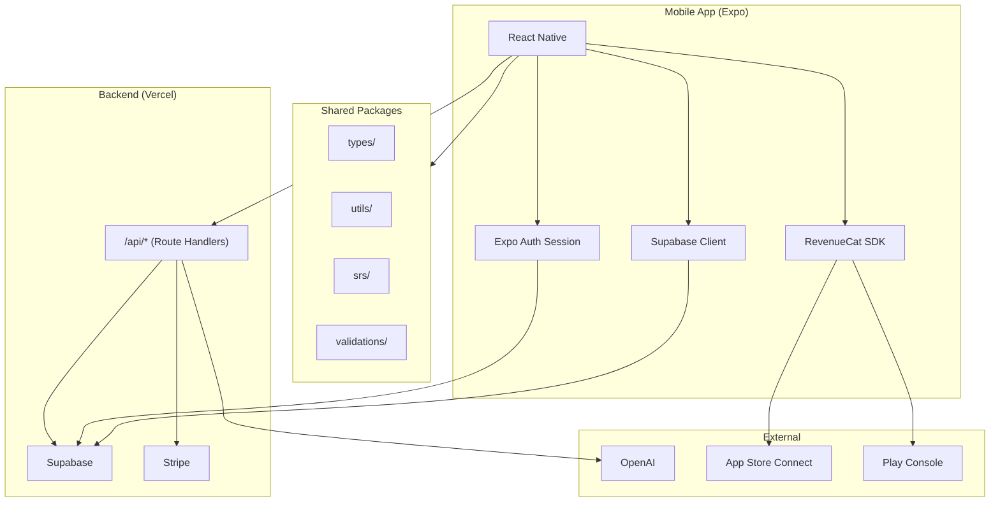

# 12. Mobile Plan

> **Status:** 基盤実装完了 (2026-01-13)。`apps/mobile/` にExpoプロジェクト作成済み。手動設定（EAS, RevenueCat, App Store Connect, Play Console）は未完了。
>
> 詳細: `docs/development-logs/20260113-phase3.5-mobile-app-setup.md`

## 概要

### 技術スタック
- **フレームワーク**: React Native + Expo (SDK 52+)
- **言語**: TypeScript
- **認証・DB**: Supabase（Webと共有）
- **API**: Web版と同じRoute Handlers
- **課金**: iOS IAP, Android Play Billing

### 開発方針
1. **コード共有最大化**: types, utils, SRSロジックを共有パッケージ化
2. **API共有**: モバイルもWeb API (`/api/*`) を呼び出し
3. **UIは別実装**: React Native コンポーネント

---

## アーキテクチャ



---

## 共有パッケージ

### パッケージ構成

```
packages/
├── shared-types/          # TypeScript型定義
│   ├── entry.ts
│   ├── enrichment.ts
│   ├── srs.ts
│   ├── entitlement.ts
│   └── index.ts
├── shared-utils/          # ユーティリティ
│   ├── date.ts
│   ├── format.ts
│   └── index.ts
├── shared-srs/            # SRS計算ロジック
│   ├── calculator.ts
│   └── index.ts
└── shared-validations/    # Zodスキーマ
    ├── entry.ts
    ├── enrichment.ts
    └── index.ts
```

### 型定義の共有

```typescript
// packages/shared-types/entry.ts
export interface Entry {
  id: string
  user_id: string
  deck_id: string | null
  term: string
  context: string | null
  enrichment: Enrichment | null
  created_at: string
  updated_at: string
}

// Web: apps/web/src/types/entry.ts
export type { Entry } from '@td2u/shared-types'

// Mobile: apps/mobile/src/types/entry.ts
export type { Entry } from '@td2u/shared-types'
```

### SRSロジックの共有

```typescript
// packages/shared-srs/calculator.ts
export function calculateNextReview(
  current: SrsData,
  rating: Rating
): SrsUpdate {
  // SM-2アルゴリズム実装
  // Web/Mobile両方で使用
}

// Web: lib/srs/index.ts
export { calculateNextReview } from '@td2u/shared-srs'

// Mobile: src/lib/srs/index.ts
export { calculateNextReview } from '@td2u/shared-srs'
```

---

## Expo構成

### プロジェクト構造

```
apps/mobile/
├── app/                    # Expo Router (ファイルベース)
│   ├── (auth)/            # 認証必須画面
│   │   ├── _layout.tsx
│   │   ├── (tabs)/
│   │   │   ├── index.tsx  # ダッシュボード
│   │   │   ├── review.tsx # 復習
│   │   │   └── settings.tsx
│   │   ├── entry/
│   │   │   ├── new.tsx
│   │   │   └── [id].tsx
│   │   └── deck/
│   │       └── [id].tsx
│   ├── (public)/          # 未認証画面
│   │   ├── login.tsx
│   │   ├── signup.tsx
│   │   └── index.tsx      # ウェルカム
│   └── _layout.tsx
├── src/
│   ├── components/
│   ├── hooks/
│   ├── lib/
│   └── theme/
├── app.config.ts
├── eas.json
└── package.json
```

### app.config.ts

```typescript
// apps/mobile/app.config.ts
import { ExpoConfig, ConfigContext } from 'expo/config'

export default ({ config }: ConfigContext): ExpoConfig => ({
  ...config,
  name: 'TD2U',
  slug: 'td2u',
  version: '1.0.0',
  orientation: 'portrait',
  icon: './assets/icon.png',
  userInterfaceStyle: 'automatic',
  splash: {
    image: './assets/splash.png',
    resizeMode: 'contain',
    backgroundColor: '#ffffff'
  },
  assetBundlePatterns: ['**/*'],
  ios: {
    supportsTablet: true,
    bundleIdentifier: 'com.td2u.app',
    config: {
      usesNonExemptEncryption: false
    }
  },
  android: {
    adaptiveIcon: {
      foregroundImage: './assets/adaptive-icon.png',
      backgroundColor: '#ffffff'
    },
    package: 'com.td2u.app'
  },
  plugins: [
    'expo-router',
    'expo-secure-store',
    [
      'expo-notifications',
      {
        icon: './assets/notification-icon.png'
      }
    ]
  ],
  extra: {
    eas: {
      projectId: 'your-project-id'
    },
    supabaseUrl: process.env.EXPO_PUBLIC_SUPABASE_URL,
    supabaseAnonKey: process.env.EXPO_PUBLIC_SUPABASE_ANON_KEY,
    revenuecatApiKey: process.env.EXPO_PUBLIC_REVENUECAT_API_KEY
  }
})
```

---

## 認証

### Supabase Auth + Expo

```typescript
// apps/mobile/src/lib/supabase.ts
import 'react-native-url-polyfill/auto'
import AsyncStorage from '@react-native-async-storage/async-storage'
import { createClient } from '@supabase/supabase-js'
import Constants from 'expo-constants'

const supabaseUrl = Constants.expoConfig?.extra?.supabaseUrl
const supabaseAnonKey = Constants.expoConfig?.extra?.supabaseAnonKey

export const supabase = createClient(supabaseUrl, supabaseAnonKey, {
  auth: {
    storage: AsyncStorage,
    autoRefreshToken: true,
    persistSession: true,
    detectSessionInUrl: false
  }
})
```

### OAuth (Google, Apple)

```typescript
// apps/mobile/src/lib/auth.ts
import * as AuthSession from 'expo-auth-session'
import * as WebBrowser from 'expo-web-browser'
import { supabase } from './supabase'

WebBrowser.maybeCompleteAuthSession()

export async function signInWithGoogle() {
  const redirectUrl = AuthSession.makeRedirectUri({
    scheme: 'td2u',
    path: 'auth/callback'
  })

  const { data, error } = await supabase.auth.signInWithOAuth({
    provider: 'google',
    options: {
      redirectTo: redirectUrl,
      skipBrowserRedirect: true
    }
  })

  if (data?.url) {
    const result = await WebBrowser.openAuthSessionAsync(
      data.url,
      redirectUrl
    )

    if (result.type === 'success') {
      const url = new URL(result.url)
      const accessToken = url.searchParams.get('access_token')
      const refreshToken = url.searchParams.get('refresh_token')

      if (accessToken && refreshToken) {
        await supabase.auth.setSession({
          access_token: accessToken,
          refresh_token: refreshToken
        })
      }
    }
  }
}

export async function signInWithApple() {
  // Apple Sign In with Expo
}
```

---

## モバイル課金

### RevenueCat統合

RevenueCatを使用してIAP/Play Billingを抽象化:

```typescript
// apps/mobile/src/lib/purchases.ts
import Purchases, {
  PurchasesPackage,
  CustomerInfo
} from 'react-native-purchases'
import Constants from 'expo-constants'
import { Platform } from 'react-native'

const REVENUECAT_API_KEY = Platform.select({
  ios: Constants.expoConfig?.extra?.revenuecatApiKeyIos,
  android: Constants.expoConfig?.extra?.revenuecatApiKeyAndroid
})!

export async function initializePurchases(userId: string) {
  Purchases.configure({
    apiKey: REVENUECAT_API_KEY,
    appUserID: userId
  })
}

export async function getOfferings() {
  const offerings = await Purchases.getOfferings()
  return offerings.current
}

export async function purchasePackage(
  pkg: PurchasesPackage
): Promise<CustomerInfo> {
  const { customerInfo } = await Purchases.purchasePackage(pkg)
  return customerInfo
}

export async function restorePurchases(): Promise<CustomerInfo> {
  return Purchases.restorePurchases()
}

export function checkPlusEntitlement(customerInfo: CustomerInfo): boolean {
  return customerInfo.entitlements.active['plus'] !== undefined
}
```

### サーバーサイド同期

RevenueCat Webhook → Supabase entitlements更新:

```typescript
// apps/web/app/api/webhooks/revenuecat/route.ts

export async function POST(request: Request) {
  const event = await request.json()

  // Webhook署名検証
  const signature = request.headers.get('X-RevenueCat-Signature')
  if (!verifySignature(event, signature)) {
    return Response.json({ error: 'Invalid signature' }, { status: 401 })
  }

  const userId = event.app_user_id
  const eventType = event.type

  switch (eventType) {
    case 'INITIAL_PURCHASE':
    case 'RENEWAL':
      await updateEntitlement(userId, 'plus')
      break
    case 'CANCELLATION':
    case 'EXPIRATION':
      await updateEntitlement(userId, 'free')
      break
    case 'NON_RENEWING_PURCHASE':
      // クレジット購入
      await addCredits(userId, event.product_id)
      break
  }

  return Response.json({ received: true })
}
```

---

## モバイル専用機能

### OCR登録（将来）

```typescript
// apps/mobile/src/features/ocr/index.ts
import * as ImagePicker from 'expo-image-picker'
import { recognizeText } from './textRecognition'

export async function captureAndExtractTerms(): Promise<string[]> {
  const result = await ImagePicker.launchCameraAsync({
    mediaTypes: ImagePicker.MediaTypeOptions.Images,
    quality: 0.8
  })

  if (!result.canceled && result.assets[0]) {
    const uri = result.assets[0].uri
    const text = await recognizeText(uri)
    return extractTerms(text)
  }

  return []
}

// ML Kit / Vision Framework でテキスト認識
async function recognizeText(imageUri: string): Promise<string> {
  // expo-ml-kit または react-native-mlkit-ocr 使用
}
```

### Share Sheet（将来）

```typescript
// apps/mobile/src/features/share/index.ts
import * as Sharing from 'expo-sharing'
import * as Linking from 'expo-linking'

// 他アプリからのテキスト共有を受け取る
export function useShareReceiver() {
  const url = Linking.useURL()

  useEffect(() => {
    if (url) {
      const { queryParams } = Linking.parse(url)
      if (queryParams?.text) {
        // Entry作成画面へナビゲート
        router.push({
          pathname: '/entry/new',
          params: { term: queryParams.text }
        })
      }
    }
  }, [url])
}
```

### Push通知

```typescript
// apps/mobile/src/lib/notifications.ts
import * as Notifications from 'expo-notifications'
import * as Device from 'expo-device'

export async function registerForPushNotifications(): Promise<string | null> {
  if (!Device.isDevice) {
    return null
  }

  const { status: existingStatus } = await Notifications.getPermissionsAsync()
  let finalStatus = existingStatus

  if (existingStatus !== 'granted') {
    const { status } = await Notifications.requestPermissionsAsync()
    finalStatus = status
  }

  if (finalStatus !== 'granted') {
    return null
  }

  const token = await Notifications.getExpoPushTokenAsync()
  return token.data
}

// 復習リマインダー
export async function scheduleReviewReminder(dueCount: number) {
  await Notifications.scheduleNotificationAsync({
    content: {
      title: '復習の時間です',
      body: `${dueCount}件の復習が待っています`,
      data: { screen: 'review' }
    },
    trigger: {
      hour: 9,
      minute: 0,
      repeats: true
    }
  })
}
```

---

## ビルド・デプロイ

### EAS Build

```json
// apps/mobile/eas.json
{
  "cli": {
    "version": ">= 5.0.0"
  },
  "build": {
    "development": {
      "developmentClient": true,
      "distribution": "internal"
    },
    "preview": {
      "distribution": "internal",
      "ios": {
        "simulator": false
      }
    },
    "production": {
      "autoIncrement": true
    }
  },
  "submit": {
    "production": {
      "ios": {
        "appleId": "your-apple-id@example.com",
        "ascAppId": "your-app-store-connect-app-id"
      },
      "android": {
        "serviceAccountKeyPath": "./play-store-key.json"
      }
    }
  }
}
```

### ビルドコマンド

```bash
# 開発ビルド
eas build --platform ios --profile development
eas build --platform android --profile development

# プレビュービルド（内部テスト）
eas build --platform all --profile preview

# 本番ビルド
eas build --platform all --profile production

# ストア提出
eas submit --platform ios
eas submit --platform android
```

---

## 開発タイムライン

### Phase 3.5: モバイル準備（2週間） - 実装状況更新 2026-01-13

| タスク | 日数 | 状況 |
|--------|------|------|
| Expoプロジェクト初期化 | 1 | ✅ 完了 |
| 共通パッケージ連携 | 2 | ✅ 完了 |
| Supabase認証連携 | 2 | ✅ 完了（コード実装済み） |
| 基本画面（ログイン、ダッシュボード、復習、設定） | 3 | ✅ 完了 |
| RevenueCat設定 | 2 | ✅ コード完了（API Key設定要） |
| IAP/Play Billing商品登録 | 1 | ⏳ 手動設定要 |
| TestFlightビルド | 1 | ⏳ 手動設定要 |
| 内部テスト | 2 | ⏳ 手動設定要 |

### Phase 4: モバイルMVP（3週間）

| タスク | 日数 |
|--------|------|
| Entry作成画面 | 2 |
| AI生成連携 | 1 |
| 復習画面 | 3 |
| Deck管理 | 2 |
| 設定画面 | 1 |
| Push通知 | 2 |
| 課金フロー実装 | 3 |
| バグ修正・テスト | 3 |
| ストア提出 | 2 |

---

## App Store ガイドライン対応

### iOS審査チェックリスト

- [ ] サブスクリプションの説明が明確
- [ ] 復元ボタンが存在
- [ ] プライバシーポリシーリンク
- [ ] 利用規約リンク
- [ ] Apple Sign In対応
- [ ] 外部決済リンクなし（Stripeへの誘導禁止）

### Android審査チェックリスト

- [ ] サブスクリプションの説明が明確
- [ ] データセーフティセクション記入
- [ ] プライバシーポリシーリンク
- [ ] ターゲット年齢設定

---

## 関連ドキュメント

- [03_architecture_web.md](./03_architecture_web.md) - Webアーキテクチャ
- [08_billing_entitlements.md](./08_billing_entitlements.md) - 課金・権利管理
- [14_repo_structure.md](./14_repo_structure.md) - リポジトリ構成
