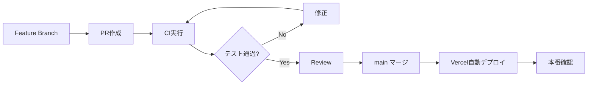

# 13. Testing & Operations

## テスト戦略

### テストピラミッド

```
        ┌─────────┐
        │   E2E   │  5%  - 主要フロー
       ┌┴─────────┴┐
       │ Integration│ 25% - API/DB連携
      ┌┴───────────┴┐
      │    Unit     │ 70% - ロジック
      └─────────────┘
```

> 実装状況: shared-srs のVitest、shared-validations のバリデーションテスト、API Route統合テスト（12ファイル）、Playwright E2Eテスト（auth, entry-flow, review-flow）が実装済み。

### テスト種別

| 種別 | 対象 | ツール | カバレッジ目標 |
|------|------|--------|--------------|
| **Unit** | SRS計算、バリデーション、ユーティリティ | Vitest | > 80% |
| **Integration** | API Route、DB操作 | Vitest + Supabase | > 60% |
| **E2E** | 認証、Entry作成、復習フロー | Playwright | 主要フロー |
| **Visual** | UIコンポーネント | Storybook | - |

---

## 単体テスト

### SRS計算テスト

```typescript
// lib/srs/__tests__/calculator.test.ts
import { describe, it, expect } from 'vitest'
import { calculateNextReview, Rating } from '../calculator'

describe('SRS Calculator', () => {
  const initialSrs = {
    easeFactor: 2.5,
    interval: 0,
    repetitions: 0,
    dueDate: new Date(),
    lastReviewedAt: null
  }

  describe('First review', () => {
    it('Again (0) resets and schedules for 1 day', () => {
      const result = calculateNextReview(initialSrs, 0)
      expect(result.interval).toBe(1)
      expect(result.repetitions).toBe(0)
    })

    it('Good (2) schedules for 1 day', () => {
      const result = calculateNextReview(initialSrs, 2)
      expect(result.interval).toBe(1)
      expect(result.repetitions).toBe(1)
    })

    it('Easy (3) schedules for 1 day with bonus', () => {
      const result = calculateNextReview(initialSrs, 3)
      expect(result.interval).toBe(1) // round(1 * 1.3)
      expect(result.repetitions).toBe(1)
    })
  })

  describe('Ease Factor bounds', () => {
    it('never goes below 1.3', () => {
      const lowEf = { ...initialSrs, easeFactor: 1.3 }
      const result = calculateNextReview(lowEf, 0)
      expect(result.easeFactor).toBeGreaterThanOrEqual(1.3)
    })
  })
})
```

### バリデーションテスト

```typescript
// lib/validations/__tests__/entry.test.ts
import { describe, it, expect } from 'vitest'
import { CreateEntrySchema } from '../entry'

describe('CreateEntrySchema', () => {
  it('accepts valid entry', () => {
    const valid = {
      term: 'SRS',
      context: 'Spaced Repetition System'
    }
    expect(CreateEntrySchema.safeParse(valid).success).toBe(true)
  })

  it('rejects empty term', () => {
    const invalid = { term: '' }
    expect(CreateEntrySchema.safeParse(invalid).success).toBe(false)
  })

  it('rejects term over 200 chars', () => {
    const invalid = { term: 'a'.repeat(201) }
    expect(CreateEntrySchema.safeParse(invalid).success).toBe(false)
  })
})
```

---

## 統合テスト

### API Route テスト

```typescript
// app/api/entries/__tests__/route.test.ts
import { describe, it, expect, beforeEach, afterEach } from 'vitest'
import { createClient } from '@supabase/supabase-js'
import { POST, GET } from '../route'

// テスト用Supabaseクライアント
const supabase = createClient(
  process.env.SUPABASE_URL!,
  process.env.SUPABASE_SERVICE_KEY!
)

describe('GET /api/entries', () => {
  let testUserId: string

  beforeEach(async () => {
    // テストユーザー作成
    const { data } = await supabase.auth.admin.createUser({
      email: 'test@example.com',
      password: 'testpassword'
    })
    testUserId = data.user!.id

    // テストデータ作成
    await supabase.from('entries').insert([
      { user_id: testUserId, term: 'Test Term 1' },
      { user_id: testUserId, term: 'Test Term 2' }
    ])
  })

  afterEach(async () => {
    // クリーンアップ
    await supabase.from('entries').delete().eq('user_id', testUserId)
    await supabase.auth.admin.deleteUser(testUserId)
  })

  it('returns user entries', async () => {
    const request = new Request('http://localhost/api/entries', {
      headers: {
        'Authorization': `Bearer ${testUserToken}`
      }
    })

    const response = await GET(request)
    const json = await response.json()

    expect(response.status).toBe(200)
    expect(json.data).toHaveLength(2)
  })
})
```

### DB操作テスト

```typescript
// lib/repositories/__tests__/entry.test.ts
import { describe, it, expect, beforeEach, afterEach } from 'vitest'
import { EntryRepository } from '../entry'

describe('EntryRepository', () => {
  let repo: EntryRepository
  let testUserId: string

  beforeEach(async () => {
    repo = new EntryRepository(supabaseServiceClient)
    // テストユーザーセットアップ
  })

  it('creates entry with SRS data', async () => {
    const entry = await repo.create({
      user_id: testUserId,
      term: 'Test',
      context: null
    })

    expect(entry.id).toBeDefined()

    // SRSデータも作成されていることを確認
    const srsData = await supabase
      .from('srs_data')
      .select()
      .eq('entry_id', entry.id)
      .single()

    expect(srsData.data).toBeDefined()
    expect(srsData.data.ease_factor).toBe(2.5)
  })
})
```

---

## E2Eテスト

### Playwright設定

```typescript
// playwright.config.ts
import { defineConfig, devices } from '@playwright/test'

export default defineConfig({
  testDir: './e2e',
  fullyParallel: true,
  forbidOnly: !!process.env.CI,
  retries: process.env.CI ? 2 : 0,
  workers: process.env.CI ? 1 : undefined,
  reporter: 'html',
  use: {
    baseURL: 'http://localhost:3000',
    trace: 'on-first-retry'
  },
  projects: [
    {
      name: 'chromium',
      use: { ...devices['Desktop Chrome'] }
    },
    {
      name: 'Mobile Safari',
      use: { ...devices['iPhone 13'] }
    }
  ],
  webServer: {
    command: 'npm run dev',
    url: 'http://localhost:3000',
    reuseExistingServer: !process.env.CI
  }
})
```

### 主要フローテスト

```typescript
// e2e/auth.spec.ts
import { test, expect } from '@playwright/test'

test.describe('Authentication', () => {
  test('user can sign up', async ({ page }) => {
    await page.goto('/signup')

    await page.fill('[name="email"]', 'test@example.com')
    await page.fill('[name="password"]', 'testpassword123')
    await page.fill('[name="confirmPassword"]', 'testpassword123')

    await page.click('button[type="submit"]')

    await expect(page).toHaveURL('/dashboard')
  })

  test('user can log in', async ({ page }) => {
    await page.goto('/login')

    await page.fill('[name="email"]', 'existing@example.com')
    await page.fill('[name="password"]', 'existingpassword')

    await page.click('button[type="submit"]')

    await expect(page).toHaveURL('/dashboard')
  })
})
```

```typescript
// e2e/entry-flow.spec.ts
import { test, expect } from '@playwright/test'

test.describe('Entry Creation Flow', () => {
  test.beforeEach(async ({ page }) => {
    // ログイン状態でテスト開始
    await page.goto('/login')
    await page.fill('[name="email"]', 'test@example.com')
    await page.fill('[name="password"]', 'testpassword')
    await page.click('button[type="submit"]')
    await page.waitForURL('/dashboard')
  })

  test('user can create entry with AI enrichment', async ({ page }) => {
    await page.click('text=新規Entry')
    await expect(page).toHaveURL('/entry/new')

    await page.fill('[name="term"]', 'SRS')
    await page.fill('[name="context"]', 'Spaced Repetition System for learning')

    await page.click('text=AI生成')

    // AI生成完了を待機
    await expect(page.locator('.enrichment-preview')).toBeVisible({
      timeout: 15000
    })

    await page.click('text=保存')

    await expect(page).toHaveURL(/\/entry\//)
  })
})
```

```typescript
// e2e/review-flow.spec.ts
import { test, expect } from '@playwright/test'

test.describe('Review Flow', () => {
  test('user can complete review session', async ({ page }) => {
    // Due entryがある状態でテスト
    await page.goto('/review')

    // カード表示確認
    await expect(page.locator('.review-card')).toBeVisible()

    // 回答確認
    await page.click('text=めくる')
    await expect(page.locator('.difficulty-buttons')).toBeVisible()

    // 難易度選択
    await page.click('text=Good')

    // 次のカード or 完了
    await expect(
      page.locator('.review-card').or(page.locator('.session-complete'))
    ).toBeVisible()
  })
})
```

---

## 監視

### エラー監視 (Sentry)

```typescript
// lib/sentry.ts
import * as Sentry from '@sentry/nextjs'

Sentry.init({
  dsn: process.env.NEXT_PUBLIC_SENTRY_DSN,
  environment: process.env.NODE_ENV,
  tracesSampleRate: 0.1,
  beforeSend(event) {
    // PIIを除去
    if (event.user) {
      delete event.user.email
      delete event.user.ip_address
    }
    return event
  }
})

// エラーログ
export function logError(error: Error, context?: Record<string, unknown>) {
  Sentry.captureException(error, { extra: context })
  console.error(error)
}
```

### アプリケーションログ

```typescript
// lib/logger.ts

type LogLevel = 'debug' | 'info' | 'warn' | 'error'

interface LogEntry {
  level: LogLevel
  message: string
  timestamp: string
  [key: string]: unknown
}

export const logger = {
  debug(message: string, meta?: object) {
    this.log('debug', message, meta)
  },

  info(message: string, meta?: object) {
    this.log('info', message, meta)
  },

  warn(message: string, meta?: object) {
    this.log('warn', message, meta)
  },

  error(message: string, error?: Error, meta?: object) {
    this.log('error', message, {
      ...meta,
      error: error?.message,
      stack: error?.stack
    })
  },

  log(level: LogLevel, message: string, meta?: object) {
    const entry: LogEntry = {
      level,
      message,
      timestamp: new Date().toISOString(),
      ...meta
    }

    // 構造化ログ出力
    console.log(JSON.stringify(entry))
  }
}

// 使用例
logger.info('Entry created', { userId, entryId })
logger.error('LLM generation failed', error, { userId, term })
```

### パフォーマンス監視

```typescript
// lib/performance.ts

export function measureDuration(name: string) {
  const start = performance.now()

  return {
    end() {
      const duration = performance.now() - start
      logger.info(`Performance: ${name}`, { duration_ms: duration })
      return duration
    }
  }
}

// 使用例
const measure = measureDuration('llm_generation')
const result = await generateEnrichment(term)
measure.end() // ログ出力: { duration_ms: 1234 }
```

### Vercel Analytics

```typescript
// app/layout.tsx
import { Analytics } from '@vercel/analytics/react'
import { SpeedInsights } from '@vercel/speed-insights/next'

export default function RootLayout({ children }) {
  return (
    <html>
      <body>
        {children}
        <Analytics />
        <SpeedInsights />
      </body>
    </html>
  )
}
```

---

## 運用手順

### デプロイフロー



### CI設定

```yaml
# .github/workflows/ci.yml
name: CI

on:
  push:
    branches: [main]
  pull_request:
    branches: [main]

jobs:
  test:
    runs-on: ubuntu-latest

    steps:
      - uses: actions/checkout@v4

      - name: Setup Node
        uses: actions/setup-node@v4
        with:
          node-version: '20'
          cache: 'npm'

      - name: Install dependencies
        run: npm ci

      - name: Type check
        run: npm run type-check

      - name: Lint
        run: npm run lint

      - name: Unit tests
        run: npm run test

      - name: E2E tests
        run: npm run test:e2e

  deploy-preview:
    needs: test
    if: github.event_name == 'pull_request'
    runs-on: ubuntu-latest
    steps:
      - name: Deploy to Vercel Preview
        uses: amondnet/vercel-action@v20
        with:
          vercel-token: ${{ secrets.VERCEL_TOKEN }}
          vercel-org-id: ${{ secrets.VERCEL_ORG_ID }}
          vercel-project-id: ${{ secrets.VERCEL_PROJECT_ID }}
```

### 障害時対応

#### 障害レベル定義

| レベル | 定義 | 対応時間 |
|--------|------|---------|
| P1 | サービス全停止 | 1時間以内 |
| P2 | 主要機能停止（認証、AI生成） | 4時間以内 |
| P3 | 一部機能停止 | 24時間以内 |
| P4 | 軽微なバグ | 1週間以内 |

#### 対応手順

```markdown
## P1/P2 インシデント対応

1. **検知**
   - Sentry アラート
   - ユーザー報告
   - ヘルスチェック失敗

2. **初動**
   - 影響範囲確認
   - 必要に応じてメンテナンス画面表示
   - Slackで状況共有

3. **調査**
   - ログ確認 (Vercel Logs)
   - Sentry エラー詳細
   - 直近のデプロイ確認

4. **対応**
   - ホットフィックス or ロールバック
   - Vercelで前バージョンにロールバック可能

5. **復旧確認**
   - 主要フロー動作確認
   - メンテナンス画面解除

6. **ポストモーテム**
   - 原因分析
   - 再発防止策
   - ドキュメント更新
```

---

## レート制限

### 実装

```typescript
// lib/rate-limit.ts
import { Ratelimit } from '@upstash/ratelimit'
import { Redis } from '@upstash/redis'

const redis = new Redis({
  url: process.env.UPSTASH_REDIS_URL!,
  token: process.env.UPSTASH_REDIS_TOKEN!
})

export const rateLimiter = new Ratelimit({
  redis,
  limiter: Ratelimit.slidingWindow(100, '1 m'), // 100 req/min
  analytics: true
})

export const enrichmentRateLimiter = new Ratelimit({
  redis,
  limiter: Ratelimit.slidingWindow(10, '1 m'), // 10 req/min
  analytics: true
})

// 使用例
export async function checkRateLimit(userId: string, limiter: Ratelimit) {
  const { success, limit, remaining, reset } = await limiter.limit(userId)

  if (!success) {
    throw new RateLimitError(reset)
  }

  return { limit, remaining, reset }
}
```

### MVPでのシンプル実装（Redis不要）

```typescript
// lib/rate-limit-simple.ts

// メモリ内で簡易レート制限（シングルインスタンス用）
const rateLimitStore = new Map<string, { count: number; resetAt: number }>()

export function checkRateLimit(
  key: string,
  limit: number,
  windowMs: number
): boolean {
  const now = Date.now()
  const record = rateLimitStore.get(key)

  if (!record || now > record.resetAt) {
    rateLimitStore.set(key, { count: 1, resetAt: now + windowMs })
    return true
  }

  if (record.count >= limit) {
    return false
  }

  record.count++
  return true
}
```

---

## 不正対策

### API保護

```typescript
// middleware.ts
import { createMiddlewareClient } from '@supabase/auth-helpers-nextjs'

export async function middleware(request: NextRequest) {
  // 認証チェック
  const res = NextResponse.next()
  const supabase = createMiddlewareClient({ req: request, res })
  const { data: { session } } = await supabase.auth.getSession()

  // API routes の保護
  if (request.nextUrl.pathname.startsWith('/api/')) {
    // Webhookは除外
    if (request.nextUrl.pathname.startsWith('/api/webhooks/')) {
      return res
    }

    if (!session) {
      return NextResponse.json({ error: 'Unauthorized' }, { status: 401 })
    }
  }

  return res
}
```

### 不正利用検知

```typescript
// lib/fraud-detection.ts

interface FraudSignal {
  userId: string
  type: 'excessive_generation' | 'suspicious_pattern' | 'rate_limit_abuse'
  details: Record<string, unknown>
}

export async function detectFraud(userId: string): Promise<FraudSignal | null> {
  // 直近1時間の生成数
  const { count } = await supabase
    .from('usage_logs')
    .select('*', { count: 'exact' })
    .eq('user_id', userId)
    .eq('action_type', 'generation')
    .gte('created_at', new Date(Date.now() - 3600000).toISOString())

  if (count > 50) {
    return {
      userId,
      type: 'excessive_generation',
      details: { hourly_count: count }
    }
  }

  return null
}

// アラート送信
export async function alertFraud(signal: FraudSignal) {
  logger.warn('Fraud signal detected', signal)
  // Slack通知等
}
```

---

## 関連ドキュメント

- [03_architecture_web.md](./03_architecture_web.md) - アーキテクチャ
- [05_api_design.md](./05_api_design.md) - API設計
- [10_metrics_growth.md](./10_metrics_growth.md) - メトリクス
