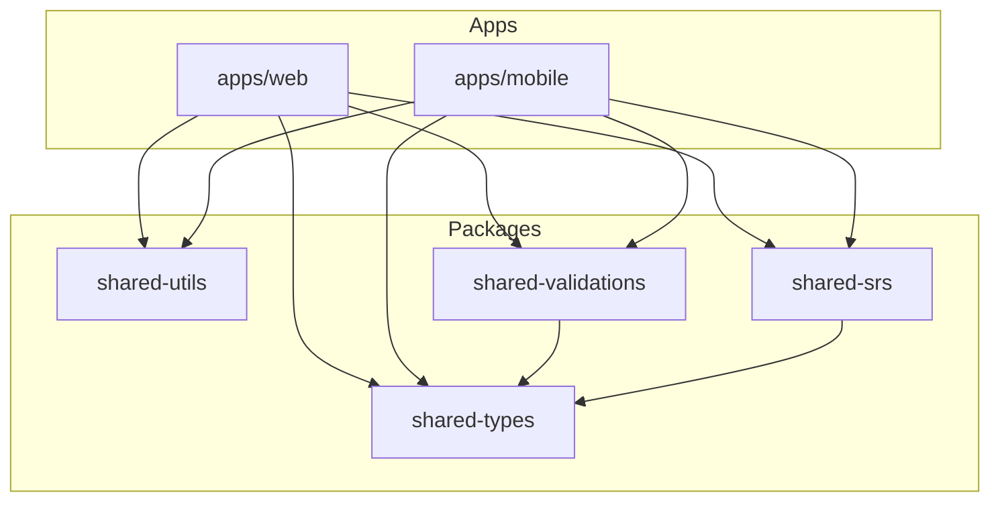

# 14. Repository Structure

## モノレポ構成

Web → Mobile 展開を見据えた Turborepo ベースのモノレポ構成を採用。

```
td2u/
├── apps/
│   ├── web/                    # Next.js Web アプリ
│   └── mobile/                 # Expo モバイルアプリ（Phase 3.5〜）
├── packages/
│   ├── shared-types/           # TypeScript 型定義
│   ├── shared-utils/           # 共通ユーティリティ
│   ├── shared-srs/             # SRS計算ロジック
│   ├── shared-validations/     # Zodスキーマ
│   └── ui/                     # 共通UIコンポーネント（将来）
├── docs/                       # 設計ドキュメント
├── prompts/                    # LLMプロンプトテンプレート
├── supabase/                   # Supabaseマイグレーション
├── scripts/                    # 開発・運用スクリプト
├── turbo.json
├── package.json
├── pnpm-workspace.yaml
└── README.md
```

---

## ディレクトリ詳細

### apps/web/ (Next.js)

```
apps/web/
├── app/                        # App Router
│   ├── (public)/              # 未認証ページ
│   │   ├── page.tsx           # ランディング
│   │   ├── login/
│   │   │   └── page.tsx
│   │   ├── signup/
│   │   │   └── page.tsx
│   │   └── pricing/
│   │       └── page.tsx
│   ├── (authenticated)/       # 認証必須ページ
│   │   ├── layout.tsx         # 認証チェックLayout
│   │   ├── dashboard/
│   │   │   └── page.tsx
│   │   ├── entry/
│   │   │   ├── new/
│   │   │   │   └── page.tsx
│   │   │   └── [id]/
│   │   │       └── page.tsx
│   │   ├── review/
│   │   │   └── page.tsx
│   │   ├── decks/
│   │   │   └── page.tsx
│   │   ├── deck/
│   │   │   └── [id]/
│   │   │       └── page.tsx
│   │   └── settings/
│   │       └── page.tsx
│   ├── api/                   # Route Handlers
│   │   ├── entries/
│   │   │   ├── route.ts       # GET, POST
│   │   │   └── [id]/
│   │   │       └── route.ts   # GET, PATCH, DELETE
│   │   ├── enrichment/
│   │   │   └── route.ts
│   │   ├── review/
│   │   │   ├── due/
│   │   │   │   └── route.ts
│   │   │   └── [id]/
│   │   │       └── route.ts
│   │   ├── decks/
│   │   │   ├── route.ts
│   │   │   └── [id]/
│   │   │       └── route.ts
│   │   ├── stats/
│   │   │   └── route.ts
│   │   ├── billing/
│   │   │   ├── checkout/
│   │   │   │   └── route.ts
│   │   │   ├── portal/
│   │   │   │   └── route.ts
│   │   │   └── credits/
│   │   │       └── route.ts
│   │   └── webhooks/
│   │       └── stripe/
│   │           └── route.ts
│   ├── checkout/
│   │   ├── success/
│   │   │   └── page.tsx
│   │   └── cancel/
│   │       └── page.tsx
│   ├── layout.tsx
│   ├── globals.css
│   └── middleware.ts
├── components/                # React コンポーネント
│   ├── ui/                   # 基本UI (Button, Input, etc.)
│   ├── layout/               # Header, Footer, Sidebar
│   ├── entry/                # Entry関連
│   │   ├── EntryCard.tsx
│   │   ├── EntryForm.tsx
│   │   ├── EntryList.tsx
│   │   └── EnrichmentPreview.tsx
│   ├── review/               # 復習関連
│   │   ├── ReviewCard.tsx
│   │   ├── DifficultyButtons.tsx
│   │   └── SessionSummary.tsx
│   ├── deck/                 # Deck関連
│   │   ├── DeckCard.tsx
│   │   └── DeckList.tsx
│   ├── dashboard/            # ダッシュボード
│   │   ├── StatsCards.tsx
│   │   └── QuickActions.tsx
│   └── billing/              # 課金関連
│       ├── PlanComparison.tsx
│       └── CreditBalance.tsx
├── lib/                      # ライブラリ・ユーティリティ
│   ├── supabase/
│   │   ├── client.ts         # ブラウザクライアント
│   │   ├── server.ts         # サーバークライアント
│   │   └── middleware.ts     # ミドルウェアクライアント
│   ├── llm/
│   │   ├── types.ts
│   │   ├── openai.ts
│   │   └── index.ts
│   ├── srs/
│   │   └── index.ts          # shared-srs を re-export
│   ├── billing/
│   │   ├── stripe.ts
│   │   └── entitlements.ts
│   ├── analytics/
│   │   └── events.ts
│   └── utils/
│       └── index.ts          # shared-utils を re-export
├── hooks/                    # カスタムフック
│   ├── useAuth.ts
│   ├── useEntries.ts
│   ├── useReview.ts
│   └── useEntitlements.ts
├── types/                    # 型定義
│   └── index.ts              # shared-types を re-export
├── public/
│   ├── favicon.ico
│   └── images/
├── e2e/                      # E2Eテスト
│   ├── auth.spec.ts
│   ├── entry-flow.spec.ts
│   └── review-flow.spec.ts
├── next.config.js
├── tailwind.config.js
├── tsconfig.json
├── vitest.config.ts
├── playwright.config.ts
└── package.json
```

### apps/mobile/ (Expo) - Phase 3.5〜

```
apps/mobile/
├── app/                      # Expo Router
│   ├── (auth)/              # 認証必須
│   │   ├── _layout.tsx
│   │   ├── (tabs)/
│   │   │   ├── _layout.tsx
│   │   │   ├── index.tsx    # ダッシュボード
│   │   │   ├── review.tsx
│   │   │   └── settings.tsx
│   │   ├── entry/
│   │   │   ├── new.tsx
│   │   │   └── [id].tsx
│   │   └── deck/
│   │       └── [id].tsx
│   ├── (public)/            # 未認証
│   │   ├── login.tsx
│   │   ├── signup.tsx
│   │   └── index.tsx        # ウェルカム
│   └── _layout.tsx
├── src/
│   ├── components/
│   ├── hooks/
│   ├── lib/
│   │   ├── supabase.ts
│   │   ├── purchases.ts     # RevenueCat
│   │   └── notifications.ts
│   ├── theme/
│   └── types/
├── assets/
├── app.config.ts
├── eas.json
├── tsconfig.json
└── package.json
```

### packages/

```
packages/
├── shared-types/
│   ├── src/
│   │   ├── entry.ts
│   │   ├── enrichment.ts
│   │   ├── srs.ts
│   │   ├── entitlement.ts
│   │   ├── deck.ts
│   │   └── index.ts
│   ├── package.json
│   └── tsconfig.json
├── shared-utils/
│   ├── src/
│   │   ├── date.ts
│   │   ├── format.ts
│   │   └── index.ts
│   ├── package.json
│   └── tsconfig.json
├── shared-srs/
│   ├── src/
│   │   ├── calculator.ts
│   │   ├── calculator.test.ts
│   │   └── index.ts
│   ├── package.json
│   └── tsconfig.json
└── shared-validations/
    ├── src/
    │   ├── entry.ts
    │   ├── enrichment.ts
    │   ├── deck.ts
    │   └── index.ts
    ├── package.json
    └── tsconfig.json
```

### supabase/

```
supabase/
├── migrations/
│   ├── 20250101000000_initial_schema.sql
│   ├── 20250102000000_add_rls.sql
│   └── 20250103000000_add_triggers.sql
├── seed.sql                  # 開発用シードデータ
└── config.toml
```

### docs/

```
docs/
├── 00_overview.md
├── 01_prd.md
├── 02_user_flows_web.md
├── 03_architecture_web.md
├── 04_data_model.md
├── 05_api_design.md
├── 06_llm_prompt_design.md
├── 07_srs_design.md
├── 08_billing_entitlements.md
├── 09_business_model_unit_economics.md
├── 10_metrics_growth.md
├── 11_roadmap.md
├── 12_mobile_plan.md
├── 13_testing_ops.md
└── 14_repo_structure.md
```

### prompts/

```
prompts/
├── enrichment.txt            # メインEnrichmentプロンプト
├── enrichment_v2.txt         # A/Bテスト版
└── system.txt                # システムプロンプト
```

---

## 設定ファイル

### turbo.json

```json
{
  "$schema": "https://turbo.build/schema.json",
  "globalDependencies": ["**/.env.*local"],
  "pipeline": {
    "build": {
      "dependsOn": ["^build"],
      "outputs": [".next/**", "!.next/cache/**", "dist/**"]
    },
    "lint": {},
    "test": {
      "dependsOn": ["^build"]
    },
    "dev": {
      "cache": false,
      "persistent": true
    },
    "type-check": {
      "dependsOn": ["^build"]
    }
  }
}
```

### pnpm-workspace.yaml

```yaml
packages:
  - 'apps/*'
  - 'packages/*'
```

### ルート package.json

```json
{
  "name": "td2u",
  "private": true,
  "scripts": {
    "dev": "turbo dev",
    "build": "turbo build",
    "lint": "turbo lint",
    "test": "turbo test",
    "type-check": "turbo type-check",
    "dev:web": "turbo dev --filter=web",
    "dev:mobile": "turbo dev --filter=mobile",
    "clean": "turbo clean && rm -rf node_modules"
  },
  "devDependencies": {
    "turbo": "^2.0.0"
  },
  "packageManager": "pnpm@8.0.0"
}
```

### apps/web/package.json

```json
{
  "name": "web",
  "version": "0.1.0",
  "private": true,
  "scripts": {
    "dev": "next dev",
    "build": "next build",
    "start": "next start",
    "lint": "next lint",
    "test": "vitest",
    "test:e2e": "playwright test",
    "type-check": "tsc --noEmit"
  },
  "dependencies": {
    "next": "^14.0.0",
    "react": "^18.0.0",
    "react-dom": "^18.0.0",
    "@supabase/supabase-js": "^2.0.0",
    "@supabase/ssr": "^0.1.0",
    "openai": "^4.0.0",
    "stripe": "^14.0.0",
    "zod": "^3.0.0",
    "swr": "^2.0.0",
    "@td2u/shared-types": "workspace:*",
    "@td2u/shared-utils": "workspace:*",
    "@td2u/shared-srs": "workspace:*",
    "@td2u/shared-validations": "workspace:*"
  },
  "devDependencies": {
    "typescript": "^5.0.0",
    "tailwindcss": "^3.0.0",
    "@types/react": "^18.0.0",
    "vitest": "^1.0.0",
    "@playwright/test": "^1.40.0",
    "eslint": "^8.0.0",
    "eslint-config-next": "^14.0.0"
  }
}
```

### packages/shared-types/package.json

```json
{
  "name": "@td2u/shared-types",
  "version": "0.1.0",
  "private": true,
  "main": "./dist/index.js",
  "types": "./dist/index.d.ts",
  "scripts": {
    "build": "tsc",
    "dev": "tsc --watch"
  },
  "devDependencies": {
    "typescript": "^5.0.0"
  }
}
```

---

## パッケージ依存関係



---

## 開発フロー

### 初期セットアップ

```bash
# リポジトリクローン
git clone https://github.com/yourname/td2u.git
cd td2u

# 依存関係インストール
pnpm install

# 環境変数設定
cp apps/web/.env.example apps/web/.env.local

# パッケージビルド
pnpm build

# 開発サーバー起動
pnpm dev:web
```

### 新機能開発

```bash
# feature ブランチ作成
git checkout -b feature/new-feature

# 開発
pnpm dev:web

# テスト
pnpm test

# リント
pnpm lint

# PR作成
```

### パッケージ追加

```bash
# Web アプリに依存追加
pnpm add package-name --filter web

# 共有パッケージに依存追加
pnpm add package-name --filter @td2u/shared-utils

# 開発依存追加
pnpm add -D package-name --filter web
```

---

## 将来の拡張

### Phase 4 以降の追加候補

```
packages/
├── ui/                       # 共通UIコンポーネント
│   ├── src/
│   │   ├── Button.tsx
│   │   ├── Input.tsx
│   │   └── Card.tsx
│   └── package.json
└── api-client/              # API クライアント（Mobile用）
    ├── src/
    │   ├── client.ts
    │   ├── entries.ts
    │   └── review.ts
    └── package.json
```

---

## 関連ドキュメント

- [03_architecture_web.md](./03_architecture_web.md) - Webアーキテクチャ
- [12_mobile_plan.md](./12_mobile_plan.md) - モバイル展開計画
- [README.md](../README.md) - セットアップガイド
